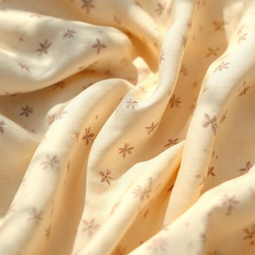

# textile

<h1 style="font-size: 2.5em; font-weight: 300; letter-spacing: 2px; margin: 0; color: #2c3e50;">
/ˈtɛkˌstaɪl/
</h1>

---

---

## 例句

When redecorating the living room, the choice of a textile that combines intricate floral patterns woven from sustainable fibers with durability was crucial to ensure it could withstand sunlight and frequent cleaning without fading or losing its texture.

*When(/wɪn/) redecorating(/riˈdɛkərˌeɪtɪŋ/) the(/ðə/) living(/ˈlɪvɪŋ/) room,(/rum,/) the(/ðə/) choice(/ʧɔɪs/) of(/əv/) a(/ə/) textile(/ˈtɛkˌstaɪl/) that(/ðət/) combines(/kəmˈbaɪnz/) intricate(/ˈɪntrəkət/) floral(/ˈflɔrəl/) patterns(/ˈpætərnz/) woven(/ˈwoʊvən/) from(/frəm/) sustainable(/səˈsteɪnəbəl/) fibers(/ˈfaɪbərz/) with(/wɪθ/) durability(/dərəˈbɪlɪti/) was(/wɑz/) crucial(/ˈkruʃəl/) to(/tɪ/) ensure(/ɪnˈʃʊr/) it(/ɪt/) could(/kʊd/) withstand(/wɪθˈstænd/) sunlight(/ˈsənˌlaɪt/) and(/ənd/) frequent(/ˈfrikˌwɛnt/) cleaning(/ˈklinɪŋ/) without(/wɪˈθaʊt/) fading(/ˈfeɪdɪŋ/) or(/ər/) losing(/ˈluzɪŋ/) its(/ɪts/) texture.(/ˈtɛksʧər./)*

**翻译：** 在重新装修客厅时，选择一种既由可持续纤维编织出精致花卉图案，又兼具耐用性的织物至关重要，以确保其能经得起阳光照射和频繁清洁，而不褪色或失去质感。

---

## 解释

英语单词“textile”作为名词，指的是用以制作家居生活用品如窗帘、床单、枕套、沙发套等的纺织品或织物。在家居生活用品的语境中，“textile”通常用来描述以纤维、线织造而成的材料，强调其物理属性和用途，如“home textiles”（家用纺织品）或“textile industry”（纺织业）。英语学习者使用该词时应注意其为可数或不可数名词，通常泛指纺织品时用不可数形式，如“The textile is soft”，而具体某种纺织品则可用复数形式“textiles”，此外常见搭配包括“textile products”“textile design”“textile manufacturing”。词源方面，“textile”源自拉丁语“textilis”，意为“编织的”，进而来自“texere”（编织、构造），反映其与织物制造紧密相关的内涵。在中文语境中，“textile”准确翻译为“纺织品”，泛指各种织造的布料，尤其是在家居应用中指用于制作家用布艺产品的材料，无特别褒贬意义，也无特殊文化色彩，属于中性词汇，注重其材质和功能属性。

---

<small style="color: #999; font-size: 0.9em;">2025-07-17 06:22:41</small>

