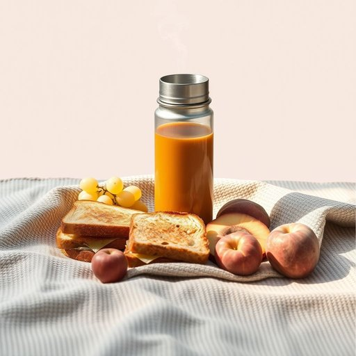

# thermos

<h1 style="font-size: 2.5em; font-weight: 300; letter-spacing: 2px; margin: 0; color: #2c3e50;">
/ˈθərməs/
</h1>

---

---

## 例句

After packing a hearty lunch for the kids, including sandwiches, fruit, and a homemade soup, Sarah carefully poured the hot broth into the thermos, which, thanks to its double-walled insulation and sturdy design, would keep it piping hot until their picnic at the park later that afternoon.

*After(/ˈæftər/) packing(/ˈpækɪŋ/) a(/ə/) hearty(/ˈhɑrti/) lunch(/lənʧ/) for(/fər/) the(/ðə/) kids,(/kɪdz,/) including(/ˌɪnˈkludɪŋ/) sandwiches,(/ˈsænwɪʧɪz,/) fruit,(/frut,/) and(/ənd/) a(/ə/) homemade(/ˈhoʊˈmeɪd/) soup,(/sup,/) Sarah(/ˈsɛrə/) carefully(/ˈkɛrfəli/) poured(/pɔrd/) the(/ðə/) hot(/hɑt/) broth(/brɔθ/) into(/ˈɪntu/) the(/ðə/) thermos,(/ˈθərməs,/) which,(/wɪʧ,/) thanks(/θæŋks/) to(/tɪ/) its(/ɪts/) double-walled(/double-walled*/) insulation(/ˌɪnsəˈleɪʃən/) and(/ənd/) sturdy(/ˈstərdi/) design,(/dɪˈzaɪn,/) would(/wʊd/) keep(/kip/) it(/ɪt/) piping(/ˈpaɪpɪŋ/) hot(/hɑt/) until(/ənˈtɪl/) their(/ðɛr/) picnic(/ˈpɪkˌnɪk/) at(/æt/) the(/ðə/) park(/pɑrk/) later(/ˈleɪtər/) that(/ðət/) afternoon.(/ˌæftərˈnun./)*

**翻译：** 为孩子们准备了一顿丰盛的午餐，包括三明治、水果和自制的汤后，莎拉小心翼翼地将滚烫的汤汁倒入保温瓶中。由于保温瓶采用了双层隔热设计且结构坚固，能确保汤在当天下午他们去公园野餐时依然保持热气腾腾。

---

## 解释

英语单词“thermos”作为名词，在家居生活用品的语境中，指的是一种具有保温功能的容器，通常用来装热饮（如茶、咖啡）或冷饮，能够长时间保持液体的温度。具体使用场合包括野餐、旅行、工作或学校等需要携带饮品且保持其温度的情境。英语学习者在使用“thermos”时应注意它通常用作可数名词，复数形式为“thermoses”或“thermos bottles”，此外，“thermos”有时也泛指所有保温瓶，但正式表达时可搭配“thermos flask”或“vacuum flask”以增加准确性。常见搭配有“a thermos of coffee”（一瓶咖啡）、“a thermos bottle”（保温瓶）等。在语法上，通常作为具体物品的名词使用，前面可用冠词，后面可接介词短语说明内容或用途。该词源自希腊语“thermos”，意为“热的”，最初由Thermos公司商标化后泛指此类保温瓶，现已成为一种通用名称。中文语境中，“thermos”准确翻译为“保温瓶”或“热水瓶”，强调其保温功能，通常理解为带有真空层的密封容器，无特殊褒贬含义，属于中性词汇，广泛应用于日常生活中，体现了现代人对便携式温控饮品容器的需求和便利。

---

<small style="color: #999; font-size: 0.9em;">2025-07-17 06:22:41</small>

