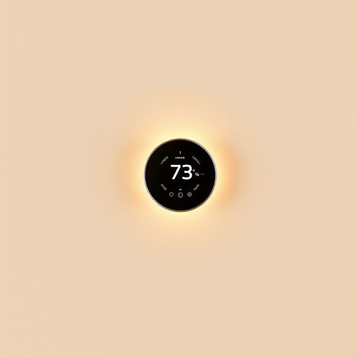

# thermostat

<h1 style="font-size: 2.5em; font-weight: 300; letter-spacing: 2px; margin: 0; color: #2c3e50;">
/ˈθərməˌstæt/
</h1>

---

---

## 例句

Before we settle in for the evening, could you please check if the thermostat, which controls the central heating and allows us to set different temperatures for various rooms, is programmed correctly to ensure the house stays warm without wasting energy?

*Before(/ˌbiˈfɔr/) we(/wi/) settle(/ˈsɛtəl/) in(/ɪn/) for(/fər/) the(/ðə/) evening,(/ˈivnɪŋ,/) could(/kʊd/) you(/ju/) please(/pliz/) check(/ʧɛk/) if(/ɪf/) the(/ðə/) thermostat,(/ˈθərməˌstæt,/) which(/wɪʧ/) controls(/kənˈtroʊlz/) the(/ðə/) central(/ˈsɛntrəl/) heating(/ˈhitɪŋ/) and(/ənd/) allows(/əˈlaʊz/) us(/ˈjuˈɛs/) to(/tɪ/) set(/sɛt/) different(/ˈdɪfərənt/) temperatures(/ˈtɛmpərəʧərz/) for(/fər/) various(/ˈvɛriəs/) rooms,(/rumz,/) is(/ɪz/) programmed(/ˈproʊˌgræmd/) correctly(/kərˈɛktli/) to(/tɪ/) ensure(/ɪnˈʃʊr/) the(/ðə/) house(/haʊs/) stays(/steɪz/) warm(/wɔrm/) without(/wɪˈθaʊt/) wasting(/ˈweɪstɪŋ/) energy?(/ˈɛnərʤi?/)*

**翻译：** 在我们准备安顿下来度过夜晚之前，能否请您检查一下中央供暖的温控器——它不仅控制整个供暖系统，还能为不同房间设定不同温度——是否已正确设置，以确保室内保持温暖且不浪费能源？

---

## 解释

“thermostat”作为名词，主要指家居或建筑环境中用于调节和控制温度的装置，常见于暖气系统、空调或热水器中，能够感知当前温度并自动启动或关闭加热或制冷设备，以维持设定的温度。其具体使用场合通常是在谈论家居生活舒适度、节能设备或智能家居系统时出现，比如“turn off the thermostat”（关闭温控器）或“set the thermostat to 22 degrees”（将温控器设定为22度）。对于英语学习者而言，thermostat作为可数名词，其复数形式为thermostats，常见搭配有“adjust the thermostat”（调节温控器）、“digital thermostat”（数字温控器）或“thermostat settings”（温控设置）。语法上需注意其作为物理设备时多用具体的可数名词用法，不用于抽象意义。同时，在表达中thermostat通常与动词如set、adjust、turn、install连用，体现其设备性和功能性。词源上，“thermostat”由希腊语“thermo-”意为“热”与“-stat”意为“保持、稳定”结合而成，整体意指“保持热度的装置”，体现其控制温度的功能。中文语境中，“thermostat”常译为“温控器”“恒温器”或“温度调节器”，准确反映其用于温度自动调节的技术设备性质，通常没有褒贬含义，属于中性词汇，广泛应用于家庭和工业环境。文化上，随着智能家居的发展，thermostat也逐渐被赋予节能环保的积极意味，但其本质仍为一个功能性器械名词。

---

<small style="color: #999; font-size: 0.9em;">2025-07-17 06:22:41</small>

