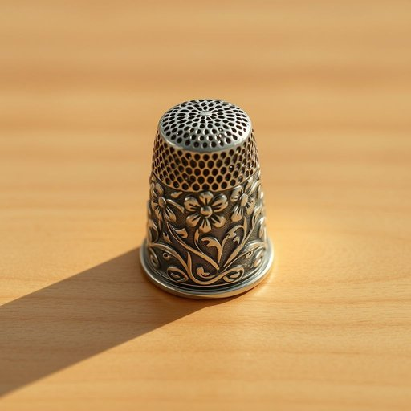

# thimble

<h1 style="font-size: 2.5em; font-weight: 300; letter-spacing: 2px; margin: 0; color: #2c3e50;">
/ˈθɪmbəl/
</h1>

---

---

## 例句

While rummaging through the old sewing box in the attic, she discovered a vintage silver thimble, intricately engraved with delicate floral patterns, which her grandmother had once used to protect her finger during hours of meticulous hand-stitching, making it not only a practical household item but also a cherished family heirloom imbued with sentimental value.

*While(/waɪl/) rummaging(/ˈrəmɪʤɪŋ/) through(/θru/) the(/ðə/) old(/oʊld/) sewing(/soʊɪŋ/) box(/bɑks/) in(/ɪn/) the(/ðə/) attic,(/ˈætɪk,/) she(/ʃi/) discovered(/dɪˈskəvərd/) a(/ə/) vintage(/ˈvɪntɪʤ/) silver(/ˈsɪlvər/) thimble,(/ˈθɪmbəl,/) intricately(/ˈɪntrəkətli/) engraved(/ɪnˈgreɪvd/) with(/wɪθ/) delicate(/ˈdɛləkət/) floral(/ˈflɔrəl/) patterns,(/ˈpætərnz,/) which(/wɪʧ/) her(/hər/) grandmother(/ˈgrændˌməðər/) had(/hæd/) once(/wəns/) used(/juzd/) to(/tɪ/) protect(/prəˈtɛkt/) her(/hər/) finger(/ˈfɪŋgər/) during(/ˈdʊrɪŋ/) hours(/aʊərz/) of(/əv/) meticulous(/məˈtɪkjələs/) hand-stitching,(/hand-stitching*,/) making(/ˈmeɪkɪŋ/) it(/ɪt/) not(/nɑt/) only(/ˈoʊnli/) a(/ə/) practical(/ˈpræktɪkəl/) household(/ˈhaʊsˌhoʊld/) item(/ˈaɪtəm/) but(/bət/) also(/ˈɔlsoʊ/) a(/ə/) cherished(/ˈʧɛrɪʃt/) family(/ˈfæməli/) heirloom(/ˈɛˌrlum/) imbued(/ˌɪmˈbjud/) with(/wɪθ/) sentimental(/ˌsɛnəˈmɛnəl/) value.(/ˈvælju./)*

**翻译：** 在翻找阁楼里那个旧缝纫盒时，她发现了一个复古的银制顶针，顶针上精细雕刻着优雅的花卉图案，这是她祖母曾用来保护手指，在长时间细致的手工缝纫中使用的。它不仅是一件实用的家居用品，更是一件蕴含深厚感情的珍贵传家宝。

---

## 解释

“thimble”作为名词，指的是一种用于缝纫时保护手指，尤其是食指的金属或塑料小顶帽，戴在指尖以防针刺伤。它主要出现在家居生活用品的语境中，尤其是在缝纫、手工制作或裁缝相关的场合。英语学习者在使用“thimble”时需注意，它是可数名词，通常用单数或复数形式（thimbles）出现，常见搭配包括“wear a thimble”（戴顶针）、“a metal/plastic thimble”（金属/塑料顶针）等。该词来源于中古英语“thymel”，再追溯至古英语“þȳmel”，其词根与手指保护物相关，反映了其历史上作为缝纫工具的功能。中文中“thimble”准确翻译为“顶针”，是缝纫工具中的专用术语，含义明确且中性，无特殊褒贬色彩或文化隐喻。一般中文语境中提到“顶针”即指此物，其实用价值主要体现为安全保护和缝纫便捷，因此理解为缝纫辅助工具即可。

---

<small style="color: #999; font-size: 0.9em;">2025-07-17 06:22:41</small>

