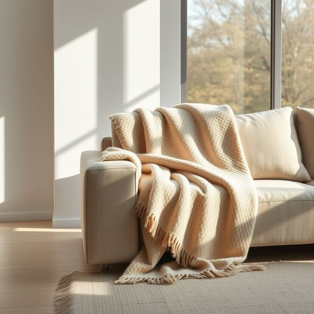

# throw

<h1 style="font-size: 2.5em; font-weight: 300; letter-spacing: 2px; margin: 0; color: #2c3e50;">
/θroʊ/
</h1>

---

---

## 例句

I decided to buy a new woollen throw, which, unlike the old one that had faded and snagged over time on the sofa by the window where we usually sit to read or have tea, adds both warmth and a splash of colour to the living room’s otherwise neutral palette.

*I(/aɪ/) decided(/ˌdɪˈsaɪdɪd/) to(/tɪ/) buy(/baɪ/) a(/ə/) new(/nu/) woollen(/ˈwʊlən/) throw,(/θroʊ,/) which,(/wɪʧ,/) unlike(/ənˈlaɪk/) the(/ðə/) old(/oʊld/) one(/wən/) that(/ðət/) had(/hæd/) faded(/ˈfeɪdɪd/) and(/ənd/) snagged(/snægd/) over(/ˈoʊvər/) time(/taɪm/) on(/ɔn/) the(/ðə/) sofa(/ˈsoʊfə/) by(/baɪ/) the(/ðə/) window(/ˈwɪndoʊ/) where(/wɛr/) we(/wi/) usually(/ˈjuʒəwəli/) sit(/sɪt/) to(/tɪ/) read(/rɛd/) or(/ər/) have(/hæv/) tea,(/ti,/) adds(/ædz/) both(/boʊθ/) warmth(/wɔrmθ/) and(/ənd/) a(/ə/) splash(/splæʃ/) of(/əv/) colour(/ˈkələr/) to(/tɪ/) the(/ðə/) living(/ˈlɪvɪŋ/) room’s(/room’s*/) otherwise(/ˈəðərˌwaɪz/) neutral(/ˈnutrəl/) palette.(/ˈpælət./)*

**翻译：** 我决定买一条新的羊毛毯子，这条毯子不同于那条随着时间推移在我们常坐着看书或喝茶的窗边沙发上褪色且勾丝的旧毯子，它不仅增添了温暖，也为客厅本来中性的色调注入了一抹亮色。

---

## 解释

英语单词“throw”作为名词在家居生活用品的语境中，通常指一种轻便的毯子或盖毯，尤其是用于沙发或椅子上的装饰性或保暖用的小毯子。具体使用场合包括客厅或卧室中，将“throw”搭在沙发扶手或床尾，以增加舒适感和美观度。英语学习者在使用“throw”作为名词时需注意，它不仅指动作“投掷”，作为名词时通常读音相同但含义不同，且在家居用品语境中多与“blanket”、“bed throw”等搭配出现，如“a cozy throw”表示“一条舒适的毯子”。此外，“throw pillow”是常见搭配，指装饰用的小靠垫。语法上，“throw”作为名词可直接作主语、宾语或定语使用。其词源源于古英语“thrawan”，意指“扭转、投掷”，但作为家居用品名词的用法发展较晚，可能因其覆盖物的“抛掷、铺展”动作而得名。在中文语境中，“throw”作为家居用品名词应准确翻译为“披毯”或“盖毯”，强调其轻便、装饰性和可移动性，区别于普通床单或厚重毯子。该词在文化上通常无褒贬色彩，但体现一种舒适、温馨的生活氛围，属于家居环境中常见且实用的装饰品。

---

<small style="color: #999; font-size: 0.9em;">2025-07-17 06:22:41</small>

