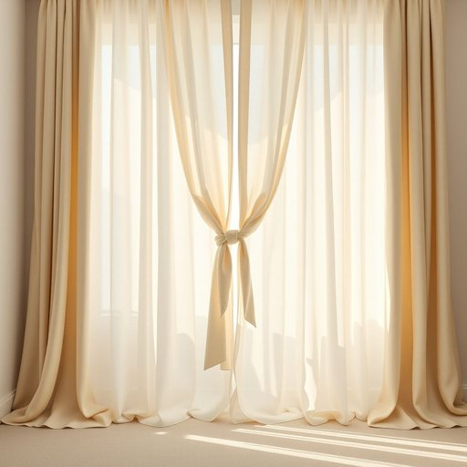

# tieback

<h1 style="font-size: 2.5em; font-weight: 300; letter-spacing: 2px; margin: 0; color: #2c3e50;">
/tieback*/
</h1>

---

---

## 例句

Could you please hand me the decorative tieback that matches the floral curtains in the living room, the one with the intricate embroidery and tassels, so I can secure the drapes properly and let more sunlight into the room?

*Could(/kʊd/) you(/ju/) please(/pliz/) hand(/hænd/) me(/mi/) the(/ðə/) decorative(/ˈdɛkrətɪv/) tieback(/tieback*/) that(/ðət/) matches(/ˈmæʧɪz/) the(/ðə/) floral(/ˈflɔrəl/) curtains(/ˈkərtənz/) in(/ɪn/) the(/ðə/) living(/ˈlɪvɪŋ/) room,(/rum,/) the(/ðə/) one(/wən/) with(/wɪθ/) the(/ðə/) intricate(/ˈɪntrəkət/) embroidery(/ɛmˈbrɔɪdəri/) and(/ənd/) tassels,(/tassels*,/) so(/soʊ/) I(/aɪ/) can(/kən/) secure(/sɪˈkjʊr/) the(/ðə/) drapes(/dreɪps/) properly(/ˈprɑpərli/) and(/ənd/) let(/lɛt/) more(/mɔr/) sunlight(/ˈsənˌlaɪt/) into(/ˈɪntu/) the(/ðə/) room?(/rum?/)*

**翻译：** 能请你把客厅那款与花卉窗帘相配、带有精致刺绣和流苏的装饰绑带递给我吗？这样我好好固定窗帘，让更多阳光照进房间。

---

## 解释

英语单词“tieback”在家居生活用品语境中作为名词，指的是一种用来绑住窗帘或帘布的装饰性带子、绳子或夹子，通常用于将窗帘束起，使其不遮挡窗户，既实用又美观，常见于客厅、卧室等有窗帘的场所。英语学习者在使用“tieback”时需注意它作为可数名词，通常与“curtain”（窗帘）连用，如“curtain tieback”，且常用复数形式“tiebacks”表示多组窗帘束带；此外，它多用于具体物品描述，句中作主语或宾语较为自然。词源方面，“tieback”由“tie”（绑、系）和“back”（后面、后方）组成，字面意思即“绑在后面”的物品，形象地说明了其功能。准确翻译为中文时，通常译作“窗帘绑带”或“窗帘束带”，强调其用途和位置，在中文家居装修与布艺领域被广泛理解和使用。该词无褒贬色彩，属于中性词汇，反映了家居生活中一个专门且实用的装饰细节，体现了西方家居布艺文化中对功能性与美观性的结合关注。

---

<small style="color: #999; font-size: 0.9em;">2025-07-17 06:22:41</small>

