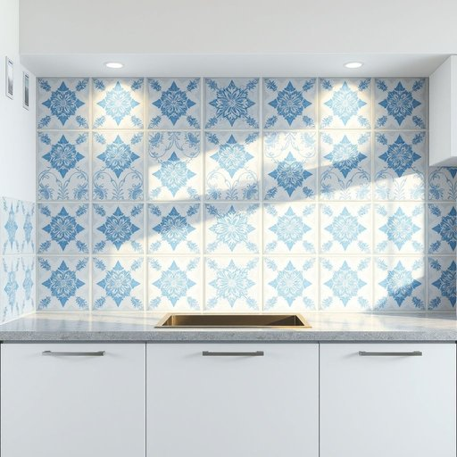

# tile

<h1 style="font-size: 2.5em; font-weight: 300; letter-spacing: 2px; margin: 0; color: #2c3e50;">
/taɪl/
</h1>

---

---

## 例句

Before we decide on the paint colour for the kitchen walls, we should consider how the new tile, which has intricate blue and white patterns and is both water-resistant and easy to clean, will complement the rest of the room's décor.

*Before(/ˌbiˈfɔr/) we(/wi/) decide(/ˌdɪˈsaɪd/) on(/ɔn/) the(/ðə/) paint(/peɪnt/) colour(/ˈkələr/) for(/fər/) the(/ðə/) kitchen(/ˈkɪʧən/) walls,(/wɔlz,/) we(/wi/) should(/ʃʊd/) consider(/kənˈsɪdər/) how(/haʊ/) the(/ðə/) new(/nu/) tile,(/taɪl,/) which(/wɪʧ/) has(/həz/) intricate(/ˈɪntrəkət/) blue(/blu/) and(/ənd/) white(/waɪt/) patterns(/ˈpætərnz/) and(/ənd/) is(/ɪz/) both(/boʊθ/) water-resistant(/water-resistant*/) and(/ənd/) easy(/ˈizi/) to(/tɪ/) clean,(/klin,/) will(/wɪl/) complement(/ˈkɑmpləmənt/) the(/ðə/) rest(/rɛst/) of(/əv/) the(/ðə/) room's(/rumz/) décor.(/décor*./)*

**翻译：** 在确定厨房墙面油漆颜色之前，我们应当先考虑新瓷砖的搭配，这些瓷砖饰以精致的蓝白花纹，既防水又易于清洁，并且能与房间的整体装饰相得益彰。

---

## 解释

英语单词“tile”作为名词在家居生活用品语境中，通常指的是用于覆盖地面、墙面或屋顶的平板状或方形材料，具体使用场合多见于厨房、浴室、客厅地板或屋顶装饰，常用于描述瓷砖、瓦片等建筑装修材料，学习者需要注意的是，“tile”作为可数名词，其复数形式为“tiles”，且常与介词短语连用，如“ceramic tiles”（陶瓷砖）、“floor tiles”（地砖）、“roof tiles”（屋顶瓦），表述更为具体，此外，tile常用于组合词或短语中，如“tile floor”（瓷砖地板）、“tile pattern”（瓷砖图案），表达细节，词源方面，“tile”源自古法语“tile”，最早来自拉丁语的“tegula”，意指砖瓦，是从古代建筑材料的一种称呼演变而来，反映其历史悠久的实用功能，在中文语境中，“tile”应准确翻译为“瓷砖”或“瓦片”，根据具体材质和用途区别理解，既可指室内装修常用的光滑瓷砖，也可指屋顶的瓦片，需结合上下文确定具体含义，该词无明显褒贬色彩，属于中性词，主要用于描述实物或材质，文化内涵上反映出人类对居住环境美观与功能性的需求。

---

<small style="color: #999; font-size: 0.9em;">2025-07-17 06:22:41</small>

