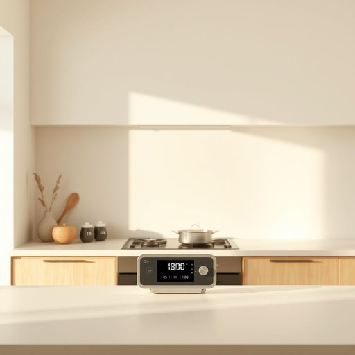

# timer

<h1 style="font-size: 2.5em; font-weight: 300; letter-spacing: 2px; margin: 0; color: #2c3e50;">
/ˈtaɪmər/
</h1>

---

---

## 例句

Could you please set the timer on the oven for exactly 45 minutes, making sure that it starts counting down as soon as the temperature reaches 180 degrees, because I want the roast to be perfectly cooked without risking it becoming overdone or drying out before we sit down to eat?

*Could(/kʊd/) you(/ju/) please(/pliz/) set(/sɛt/) the(/ðə/) timer(/ˈtaɪmər/) on(/ɔn/) the(/ðə/) oven(/ˈəvən/) for(/fər/) exactly(/ɪgˈzæktli/) 45(/45/) minutes,(/ˈmɪnəts,/) making(/ˈmeɪkɪŋ/) sure(/ʃʊr/) that(/ðət/) it(/ɪt/) starts(/stɑrts/) counting(/ˈkaʊntɪŋ/) down(/daʊn/) as(/ɛz/) soon(/sun/) as(/ɛz/) the(/ðə/) temperature(/ˈtɛmpərəʧər/) reaches(/ˈriʧɪz/) 180(/180/) degrees,(/dɪˈgriz,/) because(/bɪˈkəz/) I(/aɪ/) want(/wɔnt/) the(/ðə/) roast(/roʊst/) to(/tɪ/) be(/bi/) perfectly(/ˈpərfəktli/) cooked(/kʊkt/) without(/wɪˈθaʊt/) risking(/ˈrɪskɪŋ/) it(/ɪt/) becoming(/bɪˈkəmɪŋ/) overdone(/ˈoʊvərˈdən/) or(/ər/) drying(/draɪɪŋ/) out(/aʊt/) before(/ˌbiˈfɔr/) we(/wi/) sit(/sɪt/) down(/daʊn/) to(/tɪ/) eat?(/it?/)*

**翻译：** 请您将烤箱定时器设置为准确的45分钟，并确保一旦温度达到180度时即可开始倒计时，因为我希望烤肉能恰到好处，不至于过熟或干硬，保证我们就餐时口感完美。

---

## 解释

“timer”作为名词在家居生活用品的语境中，通常指一种用来计时和控制某一设备工作时间的装置或功能，比如厨房定时器、微波炉定时器或灯具定时开关等。具体使用场合包括煮饭时设定烹饪时间、控制家用电器开关时间、设定自动照明系统等，帮助用户合理安排时间与节能。英语学习者在使用“timer”时需注意它通常作可数名词，常见搭配有set a timer（设定定时器）、use a timer（使用定时器）、timer goes off（定时器响了）等表达，此外“timer”也可以指电子或机械装置，不同语境下侧重点不同。词源方面，“timer”源自动词“time”（计时）加后缀“-er”，意为执行计时动作的器具或装置，这一构词方式符合英语中表示工具或执行者的名词构成规律。在中文语境中，“timer”最准确的译法为“定时器”或“计时器”，突出其控制时间的功能，无褒贬含义，属于中性词。总体来看，“timer”在家居用品中是一个常见且实用的名词，表达简洁明了，不具备特殊文化色彩或隐含意义。

---

<small style="color: #999; font-size: 0.9em;">2025-07-17 06:22:41</small>

