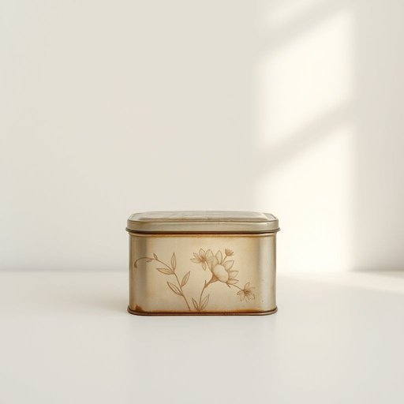

# tin

<h1 style="font-size: 2.5em; font-weight: 300; letter-spacing: 2px; margin: 0; color: #2c3e50;">
/tɪn/
</h1>

---

---

## 例句

Could you please pass me that old tin of biscuits on the top shelf, the one with the faded floral pattern and slightly dented lid, so I can offer some to our guests while we prepare the tea?

*Could(/kʊd/) you(/ju/) please(/pliz/) pass(/pæs/) me(/mi/) that(/ðət/) old(/oʊld/) tin(/tɪn/) of(/əv/) biscuits(/ˈbɪskəts/) on(/ɔn/) the(/ðə/) top(/tɔp/) shelf,(/ʃɛlf,/) the(/ðə/) one(/wən/) with(/wɪθ/) the(/ðə/) faded(/ˈfeɪdɪd/) floral(/ˈflɔrəl/) pattern(/ˈpætərn/) and(/ənd/) slightly(/sˈlaɪtli/) dented(/ˈdɛntɪd/) lid,(/lɪd,/) so(/soʊ/) I(/aɪ/) can(/kən/) offer(/ˈɔfər/) some(/səm/) to(/tɪ/) our(/ɑr/) guests(/gɛsts/) while(/waɪl/) we(/wi/) prepare(/priˈpɛr/) the(/ðə/) tea?(/ti?/)*

**翻译：** 请您把最上层那个旧的饼干铁盒递给我，就是那个带有褪色花纹、盖子略微凹陷的，以便我在准备茶点时能够招待客人。

---

## 解释

英语单词“tin”作为名词，在家居生活用品的语境中主要指金属容器，通常是由锡或镀锡铁板制成的小盒子或罐子，用于储存食物、糖果、茶叶、饼干等，常见于厨房或餐桌周围。具体使用场合包括描述食品包装，如“一罐饼干”、“一罐茶叶”或“金属罐头”，既可以指空的容器，也可以指装有物品的包装。在语法上，“tin”作为可数名词时常见的搭配有“a tin of...”，表示“某种物品的一罐（盒、罐）”，这是固定且常用的表达方式，注意“of”后面跟的是容器里装的内容物。此外，“tin”也可作为不可数名词指锡材料本身，但在家居用品中一般指容器。词源方面，“tin”一词来自古英语“tin”或“tinne”，与金属锡相关，反映了其作为锡制容器的历史背景，锡料曾广泛用于制作防腐蚀的饮食容器。在中文语境中，“tin”应准确译为“锡盒”、“锡罐”或“铁罐”，尤其强调其材质和形态，是指带盖的金属小盒或罐子，避免与“罐头”泛指的塑料或玻璃容器混淆。文化上，“tin”在口语中可能带有一点复古或亲切感，常联想到传统家庭储藏的小物件，但并无褒贬意味。学习者在使用时应注意区分“tin”与“can”的细微差别，后者更广泛指一般金属罐头，且美式英语中“tin”用得较少，英式英语中更为常见。

---

<small style="color: #999; font-size: 0.9em;">2025-07-17 06:22:41</small>

