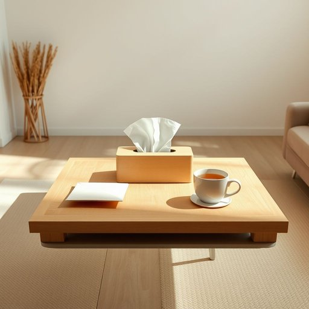

# tissue-box

<h1 style="font-size: 2.5em; font-weight: 300; letter-spacing: 2px; margin: 0; color: #2c3e50;">
/tissue-box*/
</h1>

---

---

## 例句

Could you please pass me the tissue-box that’s sitting on the living room table next to the unopened mail and the half-empty cup of tea, because my allergies are acting up and I really need to grab a tissue before I start sneezing uncontrollably?

*Could(/kʊd/) you(/ju/) please(/pliz/) pass(/pæs/) me(/mi/) the(/ðə/) tissue-box(/tissue-box*/) that’s(/that’s*/) sitting(/ˈsɪtɪŋ/) on(/ɔn/) the(/ðə/) living(/ˈlɪvɪŋ/) room(/rum/) table(/ˈteɪbəl/) next(/nɛkst/) to(/tɪ/) the(/ðə/) unopened(/əˈnoʊpənd/) mail(/meɪl/) and(/ənd/) the(/ðə/) half-empty(/half-empty*/) cup(/kəp/) of(/əv/) tea,(/ti,/) because(/bɪˈkəz/) my(/maɪ/) allergies(/ˈælərʤiz/) are(/ər/) acting(/ˈæktɪŋ/) up(/əp/) and(/ənd/) I(/aɪ/) really(/ˈrɪli/) need(/nid/) to(/tɪ/) grab(/græb/) a(/ə/) tissue(/ˈtɪʃu/) before(/ˌbiˈfɔr/) I(/aɪ/) start(/stɑrt/) sneezing(/sˈnizɪŋ/) uncontrollably?(/ˌənkənˈtroʊləbli?/)*

**翻译：** 请你把放在客厅桌子上、未拆的信件旁边那盒纸巾递给我好吗？我的过敏又犯了，得赶快拿张纸巾，不然就要忍不住不停地打喷嚏了。

---

## 解释

英语单词“tissue-box”作为名词，在家居生活用品的语境中指的是用来盛放纸巾（尤其是面巾纸或者抽取式纸巾）的盒子，通常放置在客厅、卧室、卫生间或办公室等场所，方便随时取用，体现了生活中的便利和整洁。英语学习者在使用“tissue-box”时应注意它是一个复合名词，通常作为单数或复数使用时直接加“es”（tissue-boxes），且前后可搭配形容词如“decorative tissue-box”（装饰性的纸巾盒）或限定词如“a tissue-box”、“the tissue-box”；此外，作为复合名词时，tissue是形容词性质的前置修饰，使用时不可拆分。该词汇源自“tissue”（薄纸，尤其指面巾纸）和“box”（盒子）二词的组合，表达了容器和内容物的关系，体现了语言中常见的名词+名词构词法。中文语境中，“tissue-box”准确翻译为“纸巾盒”或“面巾纸盒”，强调其功能性容器属性，不含贬义或褒义，属于中性词汇，代表日常生活中常见的实用小物，文化色彩平淡，无特殊隐喻或感情色彩。

---

<small style="color: #999; font-size: 0.9em;">2025-07-17 06:22:41</small>

