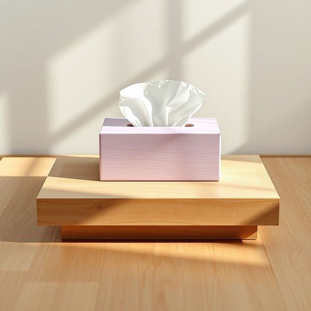

# tissue

<h1 style="font-size: 2.5em; font-weight: 300; letter-spacing: 2px; margin: 0; color: #2c3e50;">
/ˈtɪʃu/
</h1>

---

---

## 例句

Could you please pass me a tissue from the box on the living room table, the one that’s made from recycled paper and has that subtle lavender scent, since I think I’m about to catch a cold after being outside in the chilly rain for so long?

*Could(/kʊd/) you(/ju/) please(/pliz/) pass(/pæs/) me(/mi/) a(/ə/) tissue(/ˈtɪʃu/) from(/frəm/) the(/ðə/) box(/bɑks/) on(/ɔn/) the(/ðə/) living(/ˈlɪvɪŋ/) room(/rum/) table,(/ˈteɪbəl,/) the(/ðə/) one(/wən/) that’s(/that’s*/) made(/meɪd/) from(/frəm/) recycled(/riˈsaɪkəld/) paper(/ˈpeɪpər/) and(/ənd/) has(/həz/) that(/ðət/) subtle(/ˈsətəl/) lavender(/ˈlævəndər/) scent,(/sɛnt,/) since(/sɪns/) I(/aɪ/) think(/θɪŋk/) I’m(/i’m*/) about(/əˈbaʊt/) to(/tɪ/) catch(/kæʧ/) a(/ə/) cold(/koʊld/) after(/ˈæftər/) being(/biɪŋ/) outside(/ˈaʊtˈsaɪd/) in(/ɪn/) the(/ðə/) chilly(/ˈʧɪli/) rain(/reɪn/) for(/fər/) so(/soʊ/) long?(/lɔŋ?/)*

**翻译：** 你能帮我从客厅桌子上的纸巾盒里拿一张纸巾吗？就是那种用再生纸做的，带有淡淡薰衣草香味的，因为我觉得我在外面淋了那么久的凉雨，可能快要感冒了。

---

## 解释

英语单词“tissue”在家居生活用品的语境中作为名词，通常指一种轻薄且柔软的纸制品，常用于擦拭面部、手部或清洁小面积污渍，典型的例子如面巾纸或抽纸。具体使用场合多见于日常生活中，尤其是在用餐、打喷嚏、擤鼻涕或清洁时。英语学习者需要注意，“tissue”在此语义下通常作为不可数名词使用，但在复数形式“tissues”时，常指一包或多张面巾纸，如“一盒面巾纸”。此外，“tissue paper”指的是质地更薄更脆的纸，常用于包裹礼物；而“facial tissue”则专指用于面部的纸巾。常见搭配包括“buy tissues”、“use tissues”、“a box of tissues”等。需要警惕的是，tissue在生物学中还有“组织”之意，是完全不同的含义，语境不同用法区别明显。词源上，“tissue”源自法语“tissu”，意为“织物”，再追溯到拉丁语“texere”（编织），这与其纸张结构的纤维状特性相符。中文语境中准确翻译为“面巾纸”或“纸巾”，有时也泛指“薄纸”，但一般不用于指“组织”。该词在家居用品里无褒贬或特殊文化含义，是常用且中性的日常用词。总之，学习使用时要根据语境确认含义及数的用法，结合常见搭配使用，避免与生物学“组织”混淆。

---

<small style="color: #999; font-size: 0.9em;">2025-07-17 06:22:41</small>

