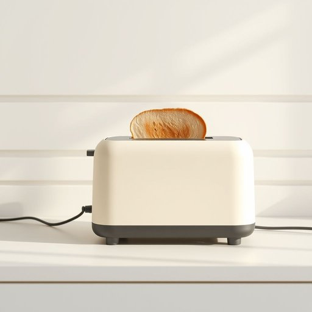

# toaster

<h1 style="font-size: 2.5em; font-weight: 300; letter-spacing: 2px; margin: 0; color: #2c3e50;">
/ˈtoʊstər/
</h1>

---

---

## 例句

Before I can enjoy my breakfast, I always check that the toaster is plugged in and heating properly to ensure it produces the perfect toast.

*Before(/ˌbiˈfɔr/) I(/aɪ/) can(/kən/) enjoy(/ˌɛnˈʤɔɪ/) my(/maɪ/) breakfast,(/ˈbrɛkfəst,/) I(/aɪ/) always(/ˈɔlˌweɪz/) check(/ʧɛk/) that(/ðət/) the(/ðə/) toaster(/ˈtoʊstər/) is(/ɪz/) plugged(/pləgd/) in(/ɪn/) and(/ənd/) heating(/ˈhitɪŋ/) properly(/ˈprɑpərli/) to(/tɪ/) ensure(/ɪnˈʃʊr/) it(/ɪt/) produces(/prəˈdusɪz/) the(/ðə/) perfect(/ˈpərˌfɪkt/) toast.(/toʊst./)*

**翻译：** 在我享用早餐之前，我总会先确认烤面包机是否已插好电并正常加热，以确保烤出完美的吐司。

---

## 解释

英语单词toaster作为名词在家居生活用品的语境中指的是一种电器设备用来将面包片加热至变脆变黄即制作吐司机烤面包的器具常见于厨房日常早餐场合使用该词时需注意其单数和复数形式toastertoasters通常与动词useturn onplug in等搭配比如turn on the toasteruse the toaster to make toast此外toaster也可作为复合词的一部分如toaster oven表示具有烘烤功能的多功能烤箱该词源于拉丁语tostare意为烘烤经过中古英语tosten演变而来反映了对面包加热的动作中文中toaster准确译为烤面包机或吐司机表示一种专门用于烤面包的厨房电器强调其功能性且无褒贬色彩属于中性词汇需要注意的是在不同文化中toaster的使用频率及重要性可能有所不同但其基本含义和用法保持一致

---

<small style="color: #999; font-size: 0.9em;">2025-07-17 06:22:41</small>

