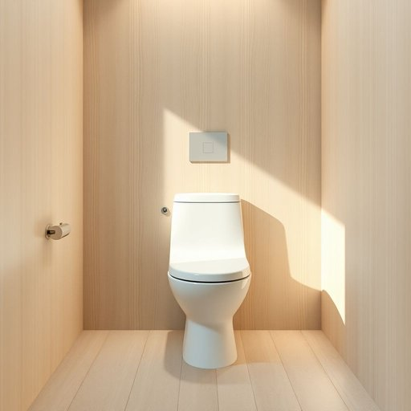

# toilet

<h1 style="font-size: 2.5em; font-weight: 300; letter-spacing: 2px; margin: 0; color: #2c3e50;">
/ˈtɔɪlət/
</h1>

---

---

## 例句

Despite the myriad challenges that ensued during the renovation process, including unforeseen plumbing issues and budget constraints, the project manager meticulously coordinated each task to ensure the completion of a water-efficient toilet that not only stopped the persistent leaks but also significantly enhanced the bathroom’s overall sustainability and compliance with modern regulations.

*Despite(/dɪˈspaɪt/) the(/ðə/) myriad(/ˈmɪriəd/) challenges(/ˈʧælənʤɪz/) that(/ðət/) ensued(/ɪnˈsud/) during(/ˈdʊrɪŋ/) the(/ðə/) renovation(/ˌrɛnəˈveɪʃən/) process,(/ˈprɔˌsɛs,/) including(/ˌɪnˈkludɪŋ/) unforeseen(/ˌənfɔrˈsin/) plumbing(/ˈpləmɪŋ/) issues(/ˈɪʃuz/) and(/ənd/) budget(/ˈbəʤɪt/) constraints,(/kənˈstreɪnts,/) the(/ðə/) project(/ˈprɑʤɛkt/) manager(/ˈmænɪʤər/) meticulously(/məˈtɪkjələsli/) coordinated(/koʊˈɔrdəneɪtɪd/) each(/iʧ/) task(/tæsk/) to(/tɪ/) ensure(/ɪnˈʃʊr/) the(/ðə/) completion(/kəmˈpliʃən/) of(/əv/) a(/ə/) water-efficient(/water-efficient*/) toilet(/ˈtɔɪlət/) that(/ðət/) not(/nɑt/) only(/ˈoʊnli/) stopped(/stɑpt/) the(/ðə/) persistent(/pərˈsɪstənt/) leaks(/liks/) but(/bət/) also(/ˈɔlsoʊ/) significantly(/sɪgˈnɪfɪkəntli/) enhanced(/ɛnˈhænst/) the(/ðə/) bathroom’s(/bathroom’s*/) overall(/ˈoʊvərˌɔl/) sustainability(/səˌsteɪnəˈbɪlɪti/) and(/ənd/) compliance(/kəmˈplaɪəns/) with(/wɪθ/) modern(/ˈmɑdərn/) regulations.(/ˌrɛgjəˈleɪʃənz./)*

**翻译：** 尽管在翻修过程中遇到了诸多挑战，包括意料之外的管道问题和预算限制，项目经理仍然细致地协调每一项任务，确保完成了一款节水马桶。这不仅有效止住了持续漏水的问题，还大幅提升了浴室的整体可持续性，且符合现代法规的要求。

---

## 解释

英语单词“toilet”作为名词在家居生活用品的语境中，通常指的是厕所或便器，即供排泄使用的设备和相应的空间，其使用场合一般是在指代家中或公共场所的卫生间设施，如“the toilet is clogged”（厕所堵塞了）或“use the toilet”（去厕所）。英语学习者需要注意的是，“toilet”作为名词时通常不可数，且在不同英语变体中表达习惯稍有不同，例如英国英语中“toilet”更常用来指代厕所，而在美国英语中则更倾向用“bathroom”或“restroom”，此外，“toilet”作为动词时表示打扮或整理仪表，但在家居用品语境中主要为名词用法。常见搭配包括“toilet bowl”（马桶座）、“toilet paper”（卫生纸）、“toilet seat”（马桶盖）等。词源方面，“toilet”源自法语“toilette”，起初指梳妆打扮的过程，后来含义扩展到有关清洁和洗漱的空间或设备，尤其是19世纪后期英语中开始指卫生间设施。在中文语境中，“toilet”一般准确翻译为“厕所”或“马桶”，强调其排泄功能，需注意其正式或非正式的用法和礼貌程度，英语中使用“toilet”时在某些情境下可能显得直接，而在正式场合更倾向用“restroom”或“lavatory”等委婉说法。总体来看，该词语色彩中性，无明显褒贬含义，但在文化上对于公共卫生设施的称呼存在一定差异，学习时应结合具体语境正确使用。

---

<small style="color: #999; font-size: 0.9em;">2025-07-17 06:22:41</small>

