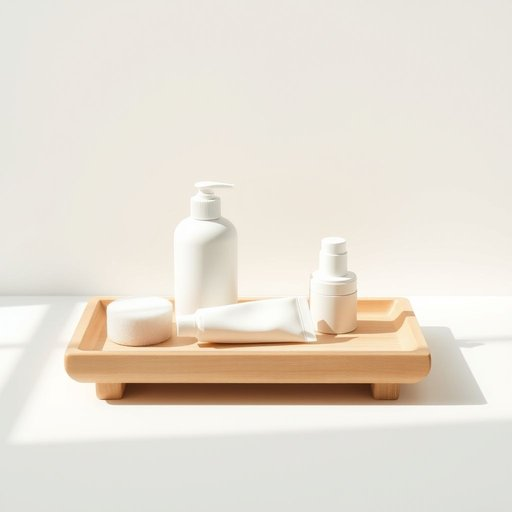

# toiletries

<h1 style="font-size: 2.5em; font-weight: 300; letter-spacing: 2px; margin: 0; color: #2c3e50;">
/ˈtɔɪlətriz/
</h1>

---

---

## 例句

Before we leave for the weekend, could you please check if we've packed all the essential toiletries, including the shampoo, toothpaste, and deodorant, because I remember last time we wished we'd brought a few extra items to avoid running to the shops mid-trip?

*Before(/ˌbiˈfɔr/) we(/wi/) leave(/liv/) for(/fər/) the(/ðə/) weekend,(/ˈwiˌkɪnd,/) could(/kʊd/) you(/ju/) please(/pliz/) check(/ʧɛk/) if(/ɪf/) we've(/wiv/) packed(/pækt/) all(/ɔl/) the(/ðə/) essential(/ɛˈsɛnʃəl/) toiletries,(/ˈtɔɪlətriz,/) including(/ˌɪnˈkludɪŋ/) the(/ðə/) shampoo,(/ʃæmˈpu,/) toothpaste,(/ˈtuθˌpeɪst,/) and(/ənd/) deodorant,(/diˈoʊdərənt,/) because(/bɪˈkəz/) I(/aɪ/) remember(/rɪˈmɛmbər/) last(/læst/) time(/taɪm/) we(/wi/) wished(/wɪʃt/) we'd(/wid/) brought(/brɔt/) a(/ə/) few(/fju/) extra(/ˈɛkstrə/) items(/ˈaɪtəmz/) to(/tɪ/) avoid(/əˈvɔɪd/) running(/ˈrənɪŋ/) to(/tɪ/) the(/ðə/) shops(/ʃɑps/) mid-trip?(/mid-trip*?/)*

**翻译：** 在我们周末出发之前，能否请你检查一下我们是否带齐了所有必需的洗漱用品，包括洗发水、牙膏和止汗剂？我记得上次我们就希望多带几样东西，以免中途还得跑去商店买。

---

## 解释

英语单词“toiletries”在家居生活用品场景中作为名词，通常指用于个人清洁和护理的日常用品，如牙膏、牙刷、香皂、洗发水、护肤品等，主要适用于描述旅行时携带或洗手间中常备的物品。使用时，“toiletries”一般以复数形式出现，且通常与动词复数形式搭配，例如“bring your toiletries”或“pack the toiletries”，英语学习者需要注意其不可数形式较少使用，而且它本身就是复数名词，常见搭配包括“basic toiletries”（基本生活用品）、“travel toiletries”（旅行洗漱用品）等。在表达技巧上，可以用“toiletries bag”指专门装这些用品的小包或化妆包。词源上，“toiletries”源自法语“toilette”，原意指洗漱和打扮，后来引申为与个人仪表护理相关的物品，体现了欧美文化中对个人卫生和外貌修饰的重视。在中文语境中，“toiletries”准确翻译为“洗漱用品”或“个人护理用品”，强调其与日常清洁和美容相关，不宜混淆为广义的生活用品，也没有褒贬色彩，是中性词汇，使用时注重具体语境尤为重要。

---

<small style="color: #999; font-size: 0.9em;">2025-07-17 06:22:41</small>

