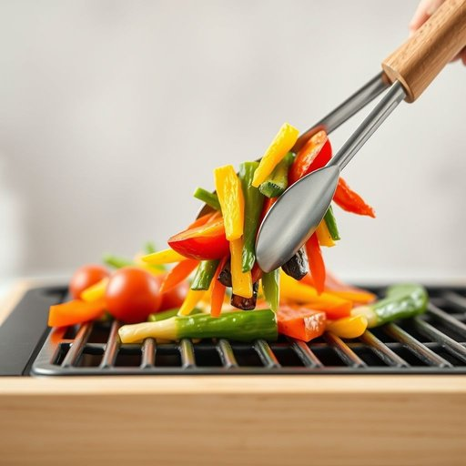

# tongs

<h1 style="font-size: 2.5em; font-weight: 300; letter-spacing: 2px; margin: 0; color: #2c3e50;">
/tɔŋz/
</h1>

---

---

## 例句

Could you use the tongs to carefully lift the hot vegetables from the grill, ensuring they don’t slip and fall while we finish cooking the rest of the meal?

*Could(/kʊd/) you(/ju/) use(/juz/) the(/ðə/) tongs(/tɔŋz/) to(/tɪ/) carefully(/ˈkɛrfəli/) lift(/lɪft/) the(/ðə/) hot(/hɑt/) vegetables(/ˈvɛʤtəbəlz/) from(/frəm/) the(/ðə/) grill,(/grɪl,/) ensuring(/ɪnˈʃʊrɪŋ/) they(/ðeɪ/) don’t(/don’t*/) slip(/slɪp/) and(/ənd/) fall(/fɔl/) while(/waɪl/) we(/wi/) finish(/ˈfɪnɪʃ/) cooking(/ˈkʊkɪŋ/) the(/ðə/) rest(/rɛst/) of(/əv/) the(/ðə/) meal?(/mil?/)*

**翻译：** 能否请你用夹子小心地把烤架上的热蔬菜夹起来，确保它们不会滑落，同时我们继续完成剩下的菜肴烹饪？

---

## 解释

英语单词“tongs”作为名词，在家居生活用品语境中通常指的是一种用于夹取食物或物件的工具，形状类似两根杠杆连接的夹子，常见于厨房和餐桌上，比如夹取烤肉、沙拉或糖果时使用。具体使用场合通常包括烹饪、餐饮和食品服务等场景，强调用来避免直接用手触碰食物或高温物品。“tongs”通常以复数形式出现，因为工具本身由两部分构成，英语学习者在使用时需注意其不可数或复数形式，且一般不用单数形式“tong”（虽有时指单个杠杆，但极少见），常见搭配如“kitchen tongs”（厨房夹具）、“grill tongs”（烤肉夹），“use the tongs to pick up the food”等表达较为常用。该词源自古英语“tongas”，指扁平的金属抓握工具，历史上用于夹持物品，演变至今保持基本形态和功能；词根与抓取动作紧密相关。在中文语境中，“tongs”准确翻译为“夹子”或“夹具”，根据具体用途也可称为“食物夹”、“烤肉夹”等，强调其夹取物品的功能，通常无褒贬色彩，属于中性且实用的生活用具词汇，但在口语中有时也用来形容人的手势或动作，需根据上下文判断。整体而言，“tongs”在生活中是非常常见且实用的厨具名称，学习时应重视其复数形式及具体使用场景。

---

<small style="color: #999; font-size: 0.9em;">2025-07-17 06:22:41</small>

