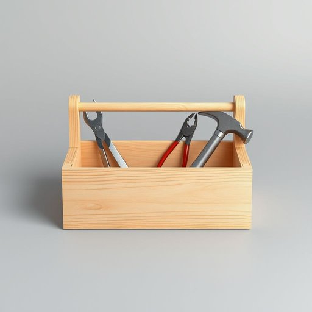

# toolbox

<h1 style="font-size: 2.5em; font-weight: 300; letter-spacing: 2px; margin: 0; color: #2c3e50;">
/ˈtulˌbɔks/
</h1>

---

---

## 例句

After witnessing the community's unwavering resilience in rebuilding after the devastating storm, the importance of cooperation as a noun became evident in the city's revival story.

*After(/ˈæftər/) witnessing(/ˈwɪtnəsɪŋ/) the(/ðə/) community's(/kəmˈjunɪtiz/) unwavering(/ənˈweɪvərɪŋ/) resilience(/rɪˈzɪljəns/) in(/ɪn/) rebuilding(/riˈbɪldɪŋ/) after(/ˈæftər/) the(/ðə/) devastating(/ˈdɛvəˌsteɪtɪŋ/) storm,(/stɔrm,/) the(/ðə/) importance(/ˌɪmˈpɔrtəns/) of(/əv/) cooperation(/kˌwɔpərˈeɪʃən/) as(/ɛz/) a(/ə/) noun(/naʊn/) became(/bɪˈkeɪm/) evident(/ˈɛvədənt/) in(/ɪn/) the(/ðə/) city's(/ˈsɪtiz/) revival(/rɪˈvaɪvəl/) story.(/ˈstɔri./)*

**翻译：** 在目睹社区在毁灭性风暴后展现出的坚定韧性重建家园之后，合作这一名词在城市复兴的故事中显得尤为重要。

---

## 解释

toolbox作为名词在家居生活用品的语境中，通常指装工具的盒子或箱子，常用于存放和组织各种手动工具，如螺丝刀、钳子、锤子等，方便维修、组装或家居修整时使用。这一单词多出现在描述家庭维修、装配、清理或DIY项目的语境中。英语学习者使用时需注意toolbox是可数名词，复数形式为toolboxes，常见固定搭配包括“carry a toolbox”（携带一个工具箱）、“open the toolbox”（打开工具箱）、“toolbox set”（工具箱套装）等，且通常与表示工具的名词连用。语法上，它通常作为具体名词出现在主语、宾语或介词宾语位置，如“The toolbox is under the sink.”词源方面，toolbox由“tool”（工具）和“box”（盒子）两个简单词合成，反映了其字面意义，即装工具的盒子，属于英语复合词，源自古英语中“tool”和中古英语“box”的组合，体现了实物名称的直观构词方式。在中文语境中，toolbox准确翻译为“工具箱”，含义明确，既指物理上的储物箱，也可以引申为“工具箱式的软件集合”等比喻用法，但在家居生活用品语境中，主要指装工具的工具箱。该词无特殊褒贬色彩，属于中性词，使用时注意搭配的具体工具名词，同时避免与电子软件相关的“工具箱”混淆。整体而言，toolbox在家居生活中是一个常用且直观的名词，便于表达带有组织和储存功能的工具容器。

---

<small style="color: #999; font-size: 0.9em;">2025-07-17 06:22:41</small>

