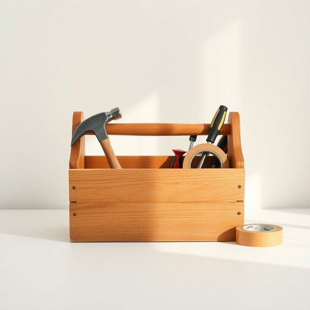

# toolkit

<h1 style="font-size: 2.5em; font-weight: 300; letter-spacing: 2px; margin: 0; color: #2c3e50;">
/toolkit*/
</h1>

---

---

## 例句

Whenever the cupboard door started creaking again, I’d fetch the old toolkit—complete with a hammer, assorted screwdrivers, and a roll of duct tape—which my father had painstakingly assembled over the years so that we could handle any minor repairs around the house without having to call in a professional.

*Whenever(/wɛˈnɛvər/) the(/ðə/) cupboard(/ˈkəbərd/) door(/dɔr/) started(/ˈstɑrtɪd/) creaking(/ˈkrikɪŋ/) again,(/əˈgɛn,/) I’d(/i’d*/) fetch(/fɛʧ/) the(/ðə/) old(/oʊld/) toolkit—complete(/toolkit—complete*/) with(/wɪθ/) a(/ə/) hammer,(/ˈhæmər,/) assorted(/əˈsɔrtɪd/) screwdrivers,(/ˈskruˌdraɪvərz,/) and(/ənd/) a(/ə/) roll(/roʊl/) of(/əv/) duct(/dəkt/) tape—which(/tape—which*/) my(/maɪ/) father(/ˈfɑðər/) had(/hæd/) painstakingly(/ˈpeɪnˌsteɪkɪŋli/) assembled(/əˈsɛmbəld/) over(/ˈoʊvər/) the(/ðə/) years(/jɪrz/) so(/soʊ/) that(/ðət/) we(/wi/) could(/kʊd/) handle(/ˈhændəl/) any(/ˈɛni/) minor(/ˈmaɪnər/) repairs(/rɪˈpɛrz/) around(/əraʊnd/) the(/ðə/) house(/haʊs/) without(/wɪˈθaʊt/) having(/ˈhævɪŋ/) to(/tɪ/) call(/kɔl/) in(/ɪn/) a(/ə/) professional.(/prəˈfɛʃənəl./)*

**翻译：** 每当橱柜门再次吱吱作响时，我就会取出那套旧工具箱——里面装着锤子、各式螺丝刀和一卷管道胶带——这是我父亲多年来悉心组装的，目的是让我们能够自行处理家中各种小修小补，无需请专业人员。

---

## 解释

“toolkit”作为名词，在家居生活用品的语境中通常指一套小型、多功能的工具组合，方便家庭日常维修、装配或简单手工制作使用，常见于家用工具箱或便携工具包中。英语学习者在使用“toolkit”时应注意它一般是可数名词，常与表示地点或用途的介词搭配，如“a toolkit for home repairs”（用于家庭维修的工具包），且通常用作具体物品，语法上多出现单数形式表示一套工具。此外，“toolkit”也常与形容词连用，如“complete toolkit”、“basic toolkit”等，表达工具种类和用途的丰富或简约。词源上，“toolkit”源于“tool”（工具）与“kit”（套装、成套物品）的组合，kit最早在英语中指携带装备的小箱或小包，合成词“toolkit”则强调一套为特定用途准备的工具集合，反映了工具组合和便携性的概念。中文语境中，通常将“toolkit”准确翻译为“工具包”或“工具箱”，强调其作为家居生活中便于携带和使用的工具集合的功能，没有明显的褒贬含义，属于中性词汇，使用时多与家庭维修、DIY活动相关，文化上体现了现代家庭对便捷维修和自主解决问题能力的重视。

---

<small style="color: #999; font-size: 0.9em;">2025-07-17 06:22:41</small>

