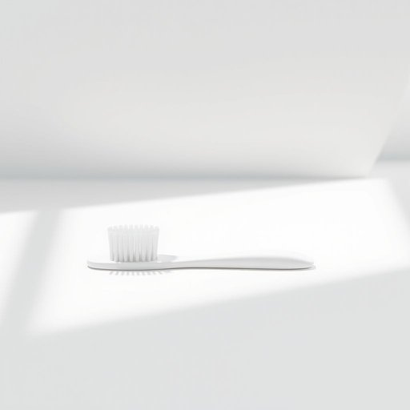

# toothbrush

<h1 style="font-size: 2.5em; font-weight: 300; letter-spacing: 2px; margin: 0; color: #2c3e50;">
/ˈtuθbrəʃ/
</h1>

---

---

## 例句

Every evening, before settling down with a book in the living room, she carefully rinses her toothbrush, which has a replaceable head and soft bristles designed to protect sensitive gums, ensuring it’s perfectly clean and ready for use the following morning.

*Every(/ˈɛvəri/) evening,(/ˈivnɪŋ,/) before(/ˌbiˈfɔr/) settling(/ˈsɛtəlɪŋ/) down(/daʊn/) with(/wɪθ/) a(/ə/) book(/bʊk/) in(/ɪn/) the(/ðə/) living(/ˈlɪvɪŋ/) room,(/rum,/) she(/ʃi/) carefully(/ˈkɛrfəli/) rinses(/rinses*/) her(/hər/) toothbrush,(/ˈtuθbrəʃ,/) which(/wɪʧ/) has(/həz/) a(/ə/) replaceable(/ˌriˈpleɪsəbəl/) head(/hɛd/) and(/ənd/) soft(/sɔft/) bristles(/ˈbrɪsəlz/) designed(/dɪˈzaɪnd/) to(/tɪ/) protect(/prəˈtɛkt/) sensitive(/ˈsɛnsɪtɪv/) gums,(/gəmz,/) ensuring(/ɪnˈʃʊrɪŋ/) it’s(/it’s*/) perfectly(/ˈpərfəktli/) clean(/klin/) and(/ənd/) ready(/ˈrɛdi/) for(/fər/) use(/juz/) the(/ðə/) following(/ˈfɑloʊɪŋ/) morning.(/ˈmɔrnɪŋ./)*

**翻译：** 每晚在客厅安坐下来读书之前，她都会仔细冲洗牙刷。那是一把配有可更换刷头、刷毛柔软以保护敏感牙龈的牙刷，她确保牙刷彻底干净，为第二天早晨的使用做好准备。

---

## 解释

toothbrush作为名词，指的是用于清洁牙齿的刷子，属于家居生活用品中的常见日用工具，通常出现在个人卫生和口腔护理的语境中，比如在讨论刷牙习惯、购买洗漱用品或旅行打包时会用到这个词。英语学习者在使用toothbrush时需要注意它是可数名词，单复数形式分别为a toothbrush和toothbrushes，常见搭配有electric toothbrush（电动牙刷）、toothbrush holder（牙刷架）、toothbrush toothpaste（牙刷与牙膏组合）等；此外，表达时通常与动词use、brush teeth with等连用。在语法上，toothbrush作为实物名词，不能用作动词，需要根据上下文明确主谓宾结构。词源方面，toothbrush由tooth（牙齿）与brush（刷子）合成，最早出现在17世纪中叶，反映了英语中复合名词的构词规律，体现出实用性与功能性相结合的命名特点。在中文语境中，toothbrush准确翻译为牙刷，这是一个中性词汇，无褒贬色彩，也无特殊文化寓意，是每个人日常生活中不可或缺的个人卫生用品，理解时需注意其功能性和使用场合的常规性。

---

<small style="color: #999; font-size: 0.9em;">2025-07-17 06:22:41</small>

