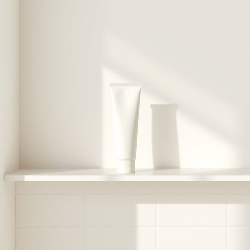

# toothpaste

<h1 style="font-size: 2.5em; font-weight: 300; letter-spacing: 2px; margin: 0; color: #2c3e50;">
/ˈtuθˌpeɪst/
</h1>

---

---

## 例句

Could you please check if we have any toothpaste left in the bathroom cabinet, because if we're out, I'll need to pop to the shop later this afternoon before our guests arrive, as I promised them we'd have everything ready for their stay?

*Could(/kʊd/) you(/ju/) please(/pliz/) check(/ʧɛk/) if(/ɪf/) we(/wi/) have(/hæv/) any(/ˈɛni/) toothpaste(/ˈtuθˌpeɪst/) left(/lɛft/) in(/ɪn/) the(/ðə/) bathroom(/ˈbæθˌrum/) cabinet,(/ˈkæbənət,/) because(/bɪˈkəz/) if(/ɪf/) we're(/wɪr/) out,(/aʊt,/) I'll(/aɪl/) need(/nid/) to(/tɪ/) pop(/pɑp/) to(/tɪ/) the(/ðə/) shop(/ʃɑp/) later(/ˈleɪtər/) this(/ðɪs/) afternoon(/ˌæftərˈnun/) before(/ˌbiˈfɔr/) our(/ɑr/) guests(/gɛsts/) arrive,(/əraɪv,/) as(/ɛz/) I(/aɪ/) promised(/ˈprɑməst/) them(/ðɛm/) we'd(/wid/) have(/hæv/) everything(/ˈɛvriˌθɪŋ/) ready(/ˈrɛdi/) for(/fər/) their(/ðɛr/) stay?(/steɪ?/)*

**翻译：** 请帮忙查看一下浴室柜里是否还有牙膏，如果用完了的话，我得在今天下午稍晚些时候去趟商店，因为我答应了客人，会为他们的到来准备好一切。

---

## 解释

“toothpaste”作为名词，指的是用于口腔清洁的牙膏，通常出现在家庭生活用品的语境中，如浴室或洗漱台上，应用场合主要是在刷牙时使用。英语学习者在使用“toothpaste”时需注意其不可数名词的性质，通常不直接使用复数形式，若要表达数量多，常用量词如 a tube of toothpaste。常见搭配有“toothpaste tube”（牙膏管）、“toothpaste brand”（牙膏品牌）、“mint-flavored toothpaste”（薄荷味牙膏）等。表达技巧上可结合“brush teeth with toothpaste”（用牙膏刷牙）等固定短语。词源方面，“toothpaste”由“tooth”（牙齿）和“paste”（糊状物）组合而成，强调其作为牙齿清洁用的糊状物质，起源于19世纪末现代牙膏工业的出现。“toothpaste”在中文语境中准确翻译为“牙膏”，无特殊褒贬色彩，是口腔护理日常用品的标准称谓。整体来看，该词简洁明了，具有明确具体的生活场景指代，不涉文化差异或隐含意义。

---

<small style="color: #999; font-size: 0.9em;">2025-07-17 06:22:41</small>

