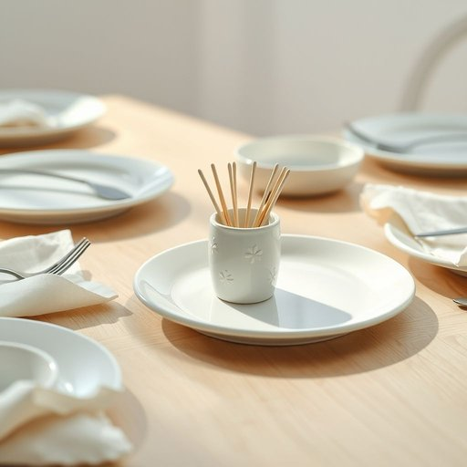

# toothpick

<h1 style="font-size: 2.5em; font-weight: 300; letter-spacing: 2px; margin: 0; color: #2c3e50;">
/ˈtuθˌpɪk/
</h1>

---

---

## 例句

After dinner, when everyone had finished their meal and the table was cluttered with empty plates and crumpled napkins, she offered a toothpick, which was neatly stored in a delicate porcelain holder embellished with a floral pattern, to anyone who needed it, reminding them that it was the perfect tool not only for removing stubborn bits of food stuck between teeth but also for delicately crafting tiny, creative garnishes for cocktails.

*After(/ˈæftər/) dinner,(/ˈdɪnər,/) when(/wɪn/) everyone(/ˈɛvriˌwən/) had(/hæd/) finished(/ˈfɪnɪʃt/) their(/ðɛr/) meal(/mil/) and(/ənd/) the(/ðə/) table(/ˈteɪbəl/) was(/wɑz/) cluttered(/ˈklətərd/) with(/wɪθ/) empty(/ˈɛmti/) plates(/pleɪts/) and(/ənd/) crumpled(/ˈkrəmpəld/) napkins,(/ˈnæpkɪnz,/) she(/ʃi/) offered(/ˈɔfərd/) a(/ə/) toothpick,(/ˈtuθˌpɪk,/) which(/wɪʧ/) was(/wɑz/) neatly(/ˈnitli/) stored(/stɔrd/) in(/ɪn/) a(/ə/) delicate(/ˈdɛləkət/) porcelain(/ˈpɔrsələn/) holder(/ˈhoʊldər/) embellished(/ɛmˈbɛlɪʃt/) with(/wɪθ/) a(/ə/) floral(/ˈflɔrəl/) pattern,(/ˈpætərn,/) to(/tɪ/) anyone(/ˈɛniˌwən/) who(/hu/) needed(/ˈnidɪd/) it,(/ɪt,/) reminding(/riˈmaɪndɪŋ/) them(/ðɛm/) that(/ðət/) it(/ɪt/) was(/wɑz/) the(/ðə/) perfect(/ˈpərˌfɪkt/) tool(/tul/) not(/nɑt/) only(/ˈoʊnli/) for(/fər/) removing(/riˈmuvɪŋ/) stubborn(/ˈstəbərn/) bits(/bɪts/) of(/əv/) food(/fud/) stuck(/stək/) between(/bɪtˈwin/) teeth(/tiθ/) but(/bət/) also(/ˈɔlsoʊ/) for(/fər/) delicately(/ˈdɛləkətli/) crafting(/ˈkræftɪŋ/) tiny,(/ˈtaɪni,/) creative(/kriˈeɪtɪv/) garnishes(/ˈgɑrnɪʃəz/) for(/fər/) cocktails.(/ˈkɑkˌteɪlz./)*

**翻译：** 晚餐过后，当所有人都已用毕餐食，桌上堆满了空盘和揉皱的餐巾纸时，她向有需要的人递上了一根牙签，那牙签整齐地收纳在一个饰有花卉图案的精致瓷质牙签筒里。她温柔地提醒大家，这不仅是用来剔除牙缝间顽固食物的完美工具，更能巧妙地制作出细腻精致的鸡尾酒小装饰。

---

## 解释

牙签作为名词，指的是一种细小、通常由木头、塑料或金属制成的尖细工具，主要用途是在家居生活中清理牙齿间的食物残渣，常见于餐桌上使用，尤为适合饭后保持口腔清洁的场合。英语学习者在使用牙签时需注意它是可数名词，通常以复数形式出现，常见搭配包括使用牙签、拿着牙签或用牙签挑牙，在表达时注意不要误用作动词，该词语本身没有贬义，属于中性词汇，也无特殊文化色彩，但在正式场合中使用牙签时应注意礼仪，否则可能被认为不雅。词源上，牙签由牙齿和挑选或挑除组成，原意即为挑牙齿的工具，最早可追溯至古英语时期，人类利用尖细物品清洁牙齿的习惯悠久。中文中，牙签准确翻译为牙签，直接对应其功能和形态，是日常生活中常见的家庭或餐桌用品。

---

<small style="color: #999; font-size: 0.9em;">2025-07-17 06:22:41</small>

