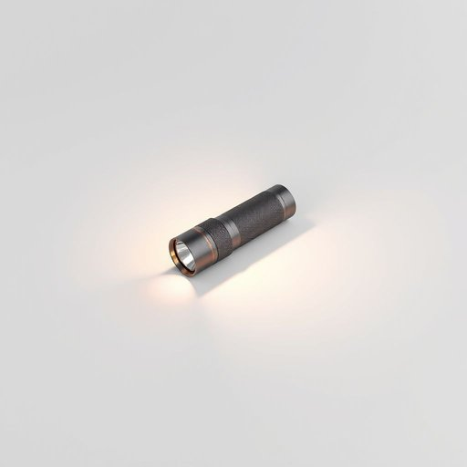

# torch

<h1 style="font-size: 2.5em; font-weight: 300; letter-spacing: 2px; margin: 0; color: #2c3e50;">
/tɔrʧ/
</h1>

---

---

## 例句

Could you please check if the torch in the kitchen drawer still has batteries, since during last night's unexpected power cut, it was the only reliable source of light that allowed us to move around safely without knocking over furniture or searching blindly in the dark?

*Could(/kʊd/) you(/ju/) please(/pliz/) check(/ʧɛk/) if(/ɪf/) the(/ðə/) torch(/tɔrʧ/) in(/ɪn/) the(/ðə/) kitchen(/ˈkɪʧən/) drawer(/drɔr/) still(/stɪl/) has(/həz/) batteries,(/ˈbætəriz,/) since(/sɪns/) during(/ˈdʊrɪŋ/) last(/læst/) night's(/naɪts/) unexpected(/ˌənɪkˈspɛktɪd/) power(/paʊər/) cut,(/kət,/) it(/ɪt/) was(/wɑz/) the(/ðə/) only(/ˈoʊnli/) reliable(/rɪˈlaɪəbəl/) source(/sɔrs/) of(/əv/) light(/laɪt/) that(/ðət/) allowed(/əˈlaʊd/) us(/ˈjuˈɛs/) to(/tɪ/) move(/muv/) around(/əraʊnd/) safely(/ˈseɪfli/) without(/wɪˈθaʊt/) knocking(/ˈnɑkɪŋ/) over(/ˈoʊvər/) furniture(/ˈfərnɪʧər/) or(/ər/) searching(/ˈsərʧɪŋ/) blindly(/ˈblaɪndli/) in(/ɪn/) the(/ðə/) dark?(/dɑrk?/)*

**翻译：** 请帮忙确认一下厨房抽屉里的手电筒还有没有电池，因为昨晚突发的停电时，它是唯一可靠的光源，使我们能够安全移动，避免碰倒家具或在黑暗中盲目摸索。

---

## 解释

英语单词“torch”作为名词在家居生活用品场景中主要指手电筒，即便携式的小型照明工具，通常由电池驱动，便于在停电、夜间或光线不足时提供局部光源。使用场合多见于家庭应急准备、户外活动如露营或检修家电时，需要短时间照明时最为常见。英语学习者在使用“torch”时应注意其在英式英语中常指手电筒，而在美式英语中更常用“flashlight”一词，二者意义相近但地区差异明显；此外，作为可数名词，“torch”常与形容词搭配使用，如“a bright torch”，或与动词连用，如“turn on/off the torch”。在表达技巧上，学习者应避免将“torch”误用为“火把”时的现代光源含义，因“torch”传统上也有火把的意思，但家居生活中以电筒为主。词源方面，“torch”源自古法语“torche”，进而来自拉丁语“torca”意为缠绕的布条，最初指点燃的火把，后来引申为现代手电筒。中文语境下，最准确的翻译为“手电筒”，体现其便携式电力光源的特征，需要区别于“火炬”“火把”等传统火焰照明工具。总体来看，“torch”在家居生活用品的语境无褒贬色彩，属实用工具词汇，是日常生活中常用的照明设备名称，文化内涵中仍保留传统火把照明的历史感，但用法上更倾向于现代电力照明设备的描述。

---

<small style="color: #999; font-size: 0.9em;">2025-07-17 06:22:41</small>

