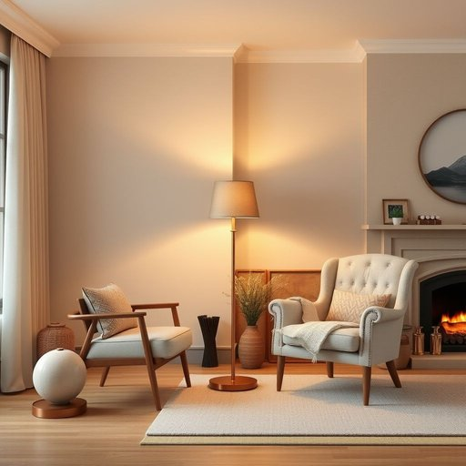

# torchère

<h1 style="font-size: 2.5em; font-weight: 300; letter-spacing: 2px; margin: 0; color: #2c3e50;">
/torchère*/
</h1>

---

---

## 例句

In the living room, where the soft glow of the fireplace mingled with the subtle illumination provided by the floor lamps, she decided that adding a vintage brass torchère, which not only complemented the Victorian armchair but also offered adjustable lighting perfect for evening reading, would complete the cozy atmosphere she had been striving to create.

*In(/ɪn/) the(/ðə/) living(/ˈlɪvɪŋ/) room,(/rum,/) where(/wɛr/) the(/ðə/) soft(/sɔft/) glow(/gloʊ/) of(/əv/) the(/ðə/) fireplace(/ˈfaɪərˌpleɪs/) mingled(/ˈmɪŋgəld/) with(/wɪθ/) the(/ðə/) subtle(/ˈsətəl/) illumination(/ˌɪˌluməˈneɪʃən/) provided(/prəˈvaɪdɪd/) by(/baɪ/) the(/ðə/) floor(/flɔr/) lamps,(/læmps,/) she(/ʃi/) decided(/ˌdɪˈsaɪdɪd/) that(/ðət/) adding(/ˈædɪŋ/) a(/ə/) vintage(/ˈvɪntɪʤ/) brass(/bræs/) torchère,(/torchère*,/) which(/wɪʧ/) not(/nɑt/) only(/ˈoʊnli/) complemented(/ˈkɑmpləˌmɛntɪd/) the(/ðə/) Victorian(/vɪkˈtɔriən/) armchair(/ˈɑrmˌʧɛr/) but(/bət/) also(/ˈɔlsoʊ/) offered(/ˈɔfərd/) adjustable(/əˈʤəstəbəl/) lighting(/ˈlaɪtɪŋ/) perfect(/ˈpərˌfɪkt/) for(/fər/) evening(/ˈivnɪŋ/) reading,(/ˈrɛdɪŋ,/) would(/wʊd/) complete(/kəmˈplit/) the(/ðə/) cozy(/ˈkoʊzi/) atmosphere(/ˈætməsˌfɪr/) she(/ʃi/) had(/hæd/) been(/bɪn/) striving(/ˈstraɪvɪŋ/) to(/tɪ/) create.(/kriˈeɪt./)*

**翻译：** 在客厅里，壁炉柔和的火光与落地灯微妙的照明交织在一起，她决定添置一盏复古的铜制落地灯，这不仅与维多利亚风格的扶手椅相得益彰，还能提供可调节的灯光，非常适合夜晚的阅读，从而圆满地打造出她一直努力营造的温馨氛围。

---

## 解释

torchère作为名词在家居生活用品的英语语境中，指的是一种高脚落地灯，通常设计优雅，用于室内照明，特别适合放置在客厅、书房或卧室角落，为环境增添柔和的光线和装饰效果。这类灯具的使用场合通常是需要营造温馨或强调氛围的空间，既有实用的照明功能，也具备装饰性价值。英语学习者在使用torchère时应注意其为可数名词，复数形式为torchères，且常与形容词搭配，如tall torchère lamp、floor torchère，在表达中常见的搭配还有turn on/off the torchère（开关落地灯）或the torchère provides ambient lighting（该落地灯提供环境照明）。此词源自法语，原意为火炬手或火把，因早期设计灵感源自手持火炬的灯具形态而得名，反映了其历史演变和设计理念。准确的中文翻译一般是落地灯或高脚落地灯，在家居语境中用于指代那种高而细长、带灯罩的室内照明设备，注意不要与普通的立灯或台灯混淆。该词在日常用语中较为书面和专业，具有一定的正式和优雅色彩，没有明显褒贬含义，主要用于描述灯具的类型和风格，体现一定的文化品味和家居装饰理念。

---

<small style="color: #999; font-size: 0.9em;">2025-07-17 06:22:41</small>

