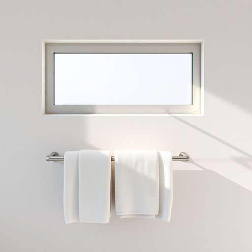

# towel-bar

<h1 style="font-size: 2.5em; font-weight: 300; letter-spacing: 2px; margin: 0; color: #2c3e50;">
/towel-bar*/
</h1>

---

---

## 例句

After renovating the bathroom, we decided to install a sleek, stainless steel towel-bar beneath the frosted window, not only because it matched the modern fixtures perfectly but also because it provided ample space to hang multiple towels, which, given our family's size and tendency to stay longer in the bath, turned out to be incredibly practical.

*After(/ˈæftər/) renovating(/ˈrɛnəˌveɪtɪŋ/) the(/ðə/) bathroom,(/ˈbæθˌrum,/) we(/wi/) decided(/ˌdɪˈsaɪdɪd/) to(/tɪ/) install(/ˌɪnˈstɔl/) a(/ə/) sleek,(/slik,/) stainless(/ˈsteɪnləs/) steel(/stil/) towel-bar(/towel-bar*/) beneath(/bɪˈniθ/) the(/ðə/) frosted(/ˈfrɔstɪd/) window,(/ˈwɪndoʊ,/) not(/nɑt/) only(/ˈoʊnli/) because(/bɪˈkəz/) it(/ɪt/) matched(/mæʧt/) the(/ðə/) modern(/ˈmɑdərn/) fixtures(/ˈfɪksʧərz/) perfectly(/ˈpərfəktli/) but(/bət/) also(/ˈɔlsoʊ/) because(/bɪˈkəz/) it(/ɪt/) provided(/prəˈvaɪdɪd/) ample(/ˈæmpəl/) space(/speɪs/) to(/tɪ/) hang(/hæŋ/) multiple(/ˈməltəpəl/) towels,(/taʊəlz,/) which,(/wɪʧ,/) given(/ˈgɪvɪn/) our(/ɑr/) family's(/ˈfæməliz/) size(/saɪz/) and(/ənd/) tendency(/ˈtɛndənsi/) to(/tɪ/) stay(/steɪ/) longer(/ˈlɔŋgər/) in(/ɪn/) the(/ðə/) bath,(/bæθ,/) turned(/tərnd/) out(/aʊt/) to(/tɪ/) be(/bi/) incredibly(/ˌɪnˈkrɛdəbli/) practical.(/ˈpræktɪkəl./)*

**翻译：** 浴室装修完成后，我们决定在磨砂窗下方安装一根造型简洁的不锈钢毛巾杆，这不仅与现代化的配件完美契合，还提供了充足的空间悬挂多条毛巾。考虑到我们家人口较多且泡澡时间较长，这一设计实用性极高。

---

## 解释

英语单词“towel-bar”作为名词，主要指家居生活中用于悬挂毛巾的长条形金属或塑料杆，通常安装在浴室或厨房墙壁上，便于毛巾晾挂和保持干燥，使用场合多见于家庭浴室、公共洗手间或宾馆等环境。学习者使用时需注意“towel-bar”是复合名词，前半部分“towel”表明毛巾，后半部分“bar”意指条状物，整体通常作可数名词使用，常见搭配包括“install a towel-bar”（安装毛巾杆）、“hang towels on the towel-bar”（在毛巾杆上挂毛巾）等表达，且在构成复合名词时多用连字符连接，以强调其整体意义。词源方面，“towel”来自古英语“tawian”，意为“擦拭”，而“bar”源自拉丁语“barra”，意指条状物，两者组合形象地表达了此物品的实用功能。中文语境中，“towel-bar”一般准确翻译为“毛巾杆”或“毛巾挂杆”，强调其物理形态和用途，属于中性词汇，无褒贬含义，也无特殊文化内涵，仅作为生活用品的专业名称使用，需注意区别于“towel rack”（毛巾架，通常能放置更多毛巾或带架子的结构）和“towel ring”（毛巾环，较小且形状为环），以免混淆。

---

<small style="color: #999; font-size: 0.9em;">2025-07-17 06:22:41</small>

