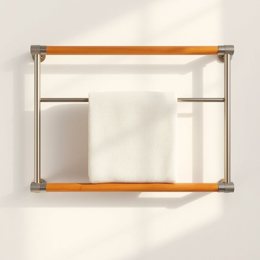

# towel-rack

<h1 style="font-size: 2.5em; font-weight: 300; letter-spacing: 2px; margin: 0; color: #2c3e50;">
/towel-rack*/
</h1>

---

---

## 例句

After the painting, which was considered a masterpiece by critics, was displayed in the gallery, the enthusiasm of the audience for the artwork grew significantly, turning the once quiet exhibition hall into a vibrant hub of artistic appreciation.

*After(/ˈæftər/) the(/ðə/) painting,(/ˈpeɪnɪŋ,/) which(/wɪʧ/) was(/wɑz/) considered(/kənˈsɪdərd/) a(/ə/) masterpiece(/ˈmæstərˌpis/) by(/baɪ/) critics,(/ˈkrɪtɪks,/) was(/wɑz/) displayed(/dɪˈspleɪd/) in(/ɪn/) the(/ðə/) gallery,(/ˈgæləri,/) the(/ðə/) enthusiasm(/ɪnˈθuziˌæzəm/) of(/əv/) the(/ðə/) audience(/ˈɔdiəns/) for(/fər/) the(/ðə/) artwork(/ˈɑrtˌwərk/) grew(/gru/) significantly,(/sɪgˈnɪfɪkəntli,/) turning(/ˈtərnɪŋ/) the(/ðə/) once(/wəns/) quiet(/kwaɪət/) exhibition(/ˌɛksəˈbɪʃən/) hall(/hɔl/) into(/ˈɪntu/) a(/ə/) vibrant(/ˈvaɪbrənt/) hub(/həb/) of(/əv/) artistic(/ɑrˈtɪstɪk/) appreciation.(/əˌpriʃiˈeɪʃən./)*

**翻译：** 这幅被评论家誉为杰作的画作在画廊展出后，观众对艺术品的热情显著高涨，使昔日宁静的展厅转变为充满活力的艺术欣赏中心。

---

## 解释

“towel-rack”作为名词，指的是用于悬挂毛巾的架子或支架，常见于浴室、厨房等家居环境，用于方便晾晒和存放毛巾，保持毛巾干燥整洁。在具体使用场合中，人们通常提到“towel-rack”时，是指固定在墙壁上或独立放置的用于挂毛巾的实物，语境多涉及家居布置、清洁整理或装修设计方面。英语学习者使用该词时应注意其构成为复合名词，由“towel”（毛巾）和“rack”（架子）组成，复合词的含义与组成部分密切相关，通常作为单数或复数形式（如towel-racks）出现。常见搭配包括“install a towel-rack”（安装毛巾架）、“hang towels on the towel-rack”（把毛巾挂在毛巾架上）、“a stainless steel towel-rack”（不锈钢毛巾架）等。语法上，该词在句中多作主语、宾语或表语，需注意与冠词、形容词等搭配的合理使用。词源方面，“towel”源自古英语“tawian”，意为擦拭，“rack”来自古英语“rac”，指支架或架子，两词结合直观表达了毛巾架的功能。该词在中文语境中对应的准确翻译为“毛巾架”或“挂毛巾的架子”，没有特殊褒贬含义，是中性词汇，主要反映家居生活中的实用器具，文化上无特别象征意义，使用时多与居家整洁和实用性相关联。

---

<small style="color: #999; font-size: 0.9em;">2025-07-17 06:22:41</small>

