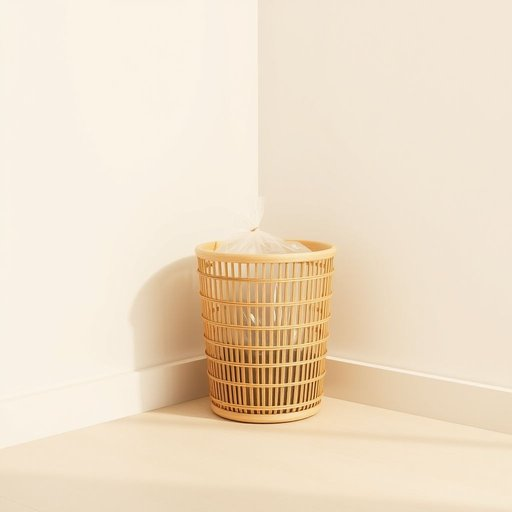

# trash

<h1 style="font-size: 2.5em; font-weight: 300; letter-spacing: 2px; margin: 0; color: #2c3e50;">
/træʃ/
</h1>

---

---

## 例句

Could you please take out the trash before you leave, making sure to tie up the plastic bag securely and double-check that all the recycling is separated properly, since the bin men won’t collect any rubbish that’s been mixed up or left loose inside?

*Could(/kʊd/) you(/ju/) please(/pliz/) take(/teɪk/) out(/aʊt/) the(/ðə/) trash(/træʃ/) before(/ˌbiˈfɔr/) you(/ju/) leave,(/liv,/) making(/ˈmeɪkɪŋ/) sure(/ʃʊr/) to(/tɪ/) tie(/taɪ/) up(/əp/) the(/ðə/) plastic(/ˈplæstɪk/) bag(/bæg/) securely(/sɪˈkjʊrli/) and(/ənd/) double-check(/ˈdəbəˌlʧɛk/) that(/ðət/) all(/ɔl/) the(/ðə/) recycling(/riˈsaɪkəlɪŋ/) is(/ɪz/) separated(/ˈsɛpərˌeɪtɪd/) properly,(/ˈprɑpərli,/) since(/sɪns/) the(/ðə/) bin(/bɪn/) men(/mɛn/) won’t(/won’t*/) collect(/kəˈlɛkt/) any(/ˈɛni/) rubbish(/ˈrəbɪʃ/) that’s(/that’s*/) been(/bɪn/) mixed(/mɪkst/) up(/əp/) or(/ər/) left(/lɛft/) loose(/lus/) inside?(/ˌɪnˈsaɪd?/)*

**翻译：** 离开前请帮忙把垃圾拿出去，务必将塑料袋扎紧，并仔细检查所有可回收物是否分类妥当，因为环卫工人不会收取混杂或散放在桶内的垃圾。

---

## 解释

英语单词“trash”作为名词在家居生活用品场景中通常指代“垃圾”或“废弃物”，具体使用场合包括家庭厨房、客厅或浴室中装废纸、食物残渣、包装材料等需要丢弃的物品。例如，人们会说“take out the trash”（倒垃圾）或“put the trash in the bin”（把垃圾放进垃圾桶）。学习者在使用时应注意“trash”作为不可数名词时通常指整体的垃圾总量，但也可以用作可数名词指具体的垃圾袋或一堆垃圾，如“a bag of trash”。常见搭配有“trash can”（垃圾桶）、“trash bag”（垃圾袋）、“garbage and trash”等，美国英语习惯使用“trash”而英国英语则多用“rubbish”。此外，“trash”在语法上属于普通名词，可用复数形式“trashes”但不常见。词源上，“trash”源自中古英语“trasche”，意指“废物、破烂”，其根源可能与古英语“tresc”有关，强调无用物品或废弃物的含义。在中文语境中，“trash”准确翻译为“垃圾”或“废弃物”，强调不可再利用且应当丢弃的废品。在使用上需注意，“trash”带有一定贬义，常用来形容没有价值甚至令人讨厌的废弃物，且在口语中有时也引申为对某物或某人的贬低称呼，如“That movie is trash”（那电影很烂），应避免在正式场合滥用以免显得粗俗。总之，“trash”作为家居生活中的名词，主要用于指代家庭产生的各类废弃垃圾，既实用又常见，但需注意其搭配习惯和语境中的语气色彩。

---

<small style="color: #999; font-size: 0.9em;">2025-07-17 06:22:41</small>

