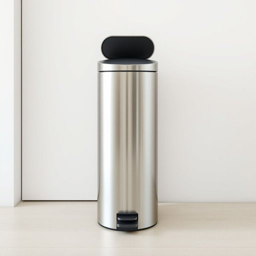

# trashcan

<h1 style="font-size: 2.5em; font-weight: 300; letter-spacing: 2px; margin: 0; color: #2c3e50;">
/trashcan*/
</h1>

---

---

## 例句

Could you please take out the rubbish and make sure to double bag it before putting it in the trashcan, which is the tall silver one next to the kitchen door that we bought last summer because it has a foot pedal and a lid that closes quietly?

*Could(/kʊd/) you(/ju/) please(/pliz/) take(/teɪk/) out(/aʊt/) the(/ðə/) rubbish(/ˈrəbɪʃ/) and(/ənd/) make(/meɪk/) sure(/ʃʊr/) to(/tɪ/) double(/ˈdəbəl/) bag(/bæg/) it(/ɪt/) before(/ˌbiˈfɔr/) putting(/ˈpʊtɪŋ/) it(/ɪt/) in(/ɪn/) the(/ðə/) trashcan,(/trashcan*,/) which(/wɪʧ/) is(/ɪz/) the(/ðə/) tall(/tɔl/) silver(/ˈsɪlvər/) one(/wən/) next(/nɛkst/) to(/tɪ/) the(/ðə/) kitchen(/ˈkɪʧən/) door(/dɔr/) that(/ðət/) we(/wi/) bought(/bɔt/) last(/læst/) summer(/ˈsəmər/) because(/bɪˈkəz/) it(/ɪt/) has(/həz/) a(/ə/) foot(/fʊt/) pedal(/ˈpɛdəl/) and(/ənd/) a(/ə/) lid(/lɪd/) that(/ðət/) closes(/ˈkloʊzɪz/) quietly?(/kˈwaɪətli?/)*

**翻译：** 请你帮忙把垃圾拿出去，放进垃圾桶前务必用两层袋子包好。垃圾桶是厨房门旁边那个我们去年夏天买的高脚银色款，带有脚踏板，盖子关得很安静。

---

## 解释

英语单词“trashcan”作为名词时，指的是家居生活中用于盛放垃圾的容器，通常见于厨房、办公室或公共场所，用来收集废纸、食物残渣等垃圾。具体使用场合一般是日常生活中谈论清理或处理垃圾时，例如“Please put the paper in the trashcan”（请把纸扔进垃圾桶）。英语学习者使用该词时应注意，trashcan是可数名词，复数形式为“trashcans”，可以与冠词（a/an/the）搭配使用，如“a trashcan”、“the trashcan”；此外，还常见搭配词有“empty the trashcan”（清空垃圾桶）、“throw something in the trashcan”（把某物扔进垃圾桶），这些表达较为地道。词源方面，“trash”源自中古英语，意为废弃物、垃圾，“can”意为容器、罐子，结合起来即废弃物的容器，词义透明且直观。中文语境中，“trashcan”一般准确翻译为“垃圾桶”或“垃圾箱”，具体选择视其材质、大小和形状而定。需要注意的是，在美式英语中，trashcan较常使用，而英国英语中类似含义更倾向于用“bin”。该词本身无褒贬色彩，属于生活常用词汇，但因其指代“垃圾”，在某些比喻性表达中可能带有贬义，例如形容事物“是trash”（垃圾）时有贬义，单词本身纯沉稳描述功能用品，无特殊文化内涵。

---

<small style="color: #999; font-size: 0.9em;">2025-07-17 06:22:41</small>

