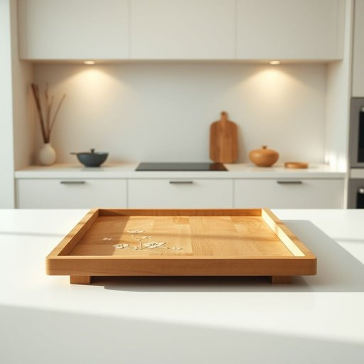

# tray

<h1 style="font-size: 2.5em; font-weight: 300; letter-spacing: 2px; margin: 0; color: #2c3e50;">
/treɪ/
</h1>

---

---

## 例句

The tray, which was carefully crafted with an intricate floral pattern and proudly purchased by Mum last summer, sat on the kitchen counter awaiting its turn to carry tea and biscuits to the guests in the living room without any spills.

*The(/ðə/) tray,(/treɪ,/) which(/wɪʧ/) was(/wɑz/) carefully(/ˈkɛrfəli/) crafted(/ˈkræftɪd/) with(/wɪθ/) an(/ən/) intricate(/ˈɪntrəkət/) floral(/ˈflɔrəl/) pattern(/ˈpætərn/) and(/ənd/) proudly(/ˈpraʊdli/) purchased(/ˈpərʧəst/) by(/baɪ/) Mum(/məm/) last(/læst/) summer,(/ˈsəmər,/) sat(/sæt/) on(/ɔn/) the(/ðə/) kitchen(/ˈkɪʧən/) counter(/ˈkaʊntər/) awaiting(/əˈweɪtɪŋ/) its(/ɪts/) turn(/tərn/) to(/tɪ/) carry(/ˈkɛri/) tea(/ti/) and(/ənd/) biscuits(/ˈbɪskəts/) to(/tɪ/) the(/ðə/) guests(/gɛsts/) in(/ɪn/) the(/ðə/) living(/ˈlɪvɪŋ/) room(/rum/) without(/wɪˈθaʊt/) any(/ˈɛni/) spills.(/spɪlz./)*

**翻译：** 那个托盘，经过精心制作，饰以复杂精美的花卉图案，去年夏天由妈妈自豪地购得，如今静静地放在厨房台面上，等待着端茶送饼到客厅宾客面前，不洒一滴。

---

## 解释

英语单词“tray”作为名词在家居生活用品的语境中，通常指一种扁平且边缘带有浅边的盘子或托盘，用于盛放、搬运或展示食物、饮料、餐具等物品，常见于厨房、餐厅、办公室等场合，例如茶盘、点心盘或文件托盘。英语学习者使用时应注意，“tray”一般作可数名词，常见的搭配有“serving tray”（上菜盘）、“ice cube tray”（冰块托盘）、“drip tray”（接水盘）等，动词形式较少用，语法上其复数形式为“trays”。表达时可结合形容词或物品名称使用，帮助明确功能或材质，如“wooden tray”（木盘），“plastic tray”（塑料盘）。词源上，“tray”源自中古英语“traie”，进一步来源于古法语“traïe”，指金属盘，体现其作为承载容器的历史功能。在中文语境中，“tray”准确翻译为“托盘”或“盘子”，强调其用于承载和搬运物品的功能，没有特别褒贬含义，属于中性词汇。文化上，“tray”因便于整齐移动物品，常与餐饮服务、家庭整理、仪式性场合等联系，体现实用性和礼仪感，无明显色彩倾向。

---

<small style="color: #999; font-size: 0.9em;">2025-07-17 06:22:41</small>

