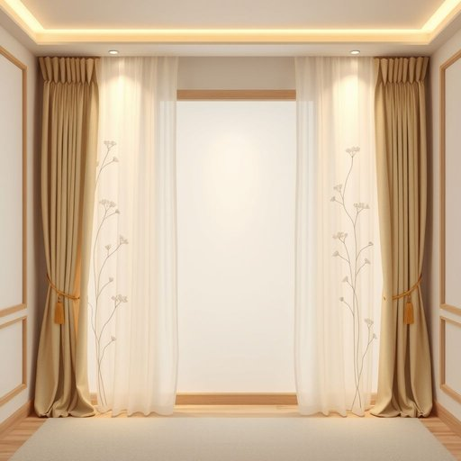

# trim

<h1 style="font-size: 2.5em; font-weight: 300; letter-spacing: 2px; margin: 0; color: #2c3e50;">
/trɪm/
</h1>

---

---

## 例句

The trim, which serves as an essential decorative element, not only enhances the visual appeal of the curtains with its intricate gold threading but also harmonizes perfectly with the wallpaper's delicate floral pattern, thereby adding a sophisticated and subtle touch of elegance to the entire living room décor.

*The(/ðə/) trim,(/trɪm,/) which(/wɪʧ/) serves(/sərvz/) as(/ɛz/) an(/ən/) essential(/ɛˈsɛnʃəl/) decorative(/ˈdɛkrətɪv/) element,(/ˈɛləmənt,/) not(/nɑt/) only(/ˈoʊnli/) enhances(/ɛnˈhænsɪz/) the(/ðə/) visual(/ˈvɪʒəwəl/) appeal(/əˈpil/) of(/əv/) the(/ðə/) curtains(/ˈkərtənz/) with(/wɪθ/) its(/ɪts/) intricate(/ˈɪntrəkət/) gold(/goʊld/) threading(/θˈrɛdɪŋ/) but(/bət/) also(/ˈɔlsoʊ/) harmonizes(/ˈhɑrməˌnaɪzɪz/) perfectly(/ˈpərfəktli/) with(/wɪθ/) the(/ðə/) wallpaper's(/wallpaper's*/) delicate(/ˈdɛləkət/) floral(/ˈflɔrəl/) pattern,(/ˈpætərn,/) thereby(/ˈðɛrˈbaɪ/) adding(/ˈædɪŋ/) a(/ə/) sophisticated(/səˈfɪstɪˌkeɪtəd/) and(/ənd/) subtle(/ˈsətəl/) touch(/təʧ/) of(/əv/) elegance(/ˈɛləgəns/) to(/tɪ/) the(/ðə/) entire(/ɪnˈtaɪər/) living(/ˈlɪvɪŋ/) room(/rum/) décor.(/décor*./)*

**翻译：** 这条装饰条不仅作为重要的装饰元素，通过其精致的金线刺绣提升了窗帘的视觉美感，还与壁纸细腻的花卉图案完美契合，为整个客厅装饰增添了一抹雅致而含蓄的优雅气息。

---

## 解释

“trim”作为名词在家居生活用品的语境中，通常指的是装饰边饰或装边物，如窗帘、家具、墙面或门窗周围的装饰线条、边框或镶边，常用于提升居室的美观和细节感。具体使用场合包括房屋装修、家具设计或布艺产品中，比如窗帘边上的流苏或丝带，沙发边的装饰条，以及木质门框的饰边。英语学习者需要注意“trim”作为名词时，多数情况下是不可数名词，但当指具体的装饰条或不同种类的装饰材料时，也可以用复数形式“trims”；同时，“trim”与“decorative trim”（装饰条），“wood trim”（木质装饰线条）等词组搭配较为常见，表达时可以结合形容词描述材质、颜色或风格，以更准确传达含义。词源上，“trim”一词源自中古英语“trimmen”，进一步源自古诺尔斯语“trymja”，意为“装饰、布置”，体现了其作为装饰物的历史功能。中文语境中，“trim”作为家居用品名词应理解为“装饰边”、“装饰条”或“镶边”，指的是家居中起点缀和美化作用的边缘装饰，通常没有褒贬含义，属于中性词汇，但在特定搭配下也可以体现精细、考究的装饰风格，是室内设计中体现品味和细节的重要元素。

---

<small style="color: #999; font-size: 0.9em;">2025-07-17 06:22:41</small>

