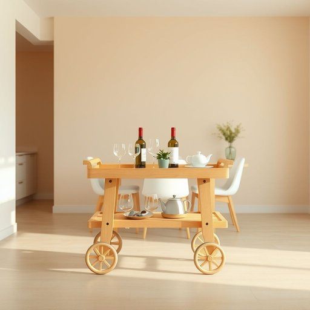

# trolley

<h1 style="font-size: 2.5em; font-weight: 300; letter-spacing: 2px; margin: 0; color: #2c3e50;">
/ˈtrɑli/
</h1>

---

---

## 例句

While preparing for the dinner party, she carefully wheeled the fully stocked trolley, which was laden with glasses, cutlery, and several bottles of wine, from the kitchen into the dining room, ensuring that everything was perfectly arranged for the guests to serve themselves easily.

*While(/waɪl/) preparing(/pərˈpɛrɪŋ/) for(/fər/) the(/ðə/) dinner(/ˈdɪnər/) party,(/ˈpɑrti,/) she(/ʃi/) carefully(/ˈkɛrfəli/) wheeled(/wild/) the(/ðə/) fully(/ˈfʊli/) stocked(/stɑkt/) trolley,(/ˈtrɑli,/) which(/wɪʧ/) was(/wɑz/) laden(/ˈleɪdən/) with(/wɪθ/) glasses,(/ˈglæsɪz,/) cutlery,(/ˈkətləri,/) and(/ənd/) several(/ˈsɛvərəl/) bottles(/ˈbɑtəlz/) of(/əv/) wine,(/waɪn,/) from(/frəm/) the(/ðə/) kitchen(/ˈkɪʧən/) into(/ˈɪntu/) the(/ðə/) dining(/ˈdaɪnɪŋ/) room,(/rum,/) ensuring(/ɪnˈʃʊrɪŋ/) that(/ðət/) everything(/ˈɛvriˌθɪŋ/) was(/wɑz/) perfectly(/ˈpərfəktli/) arranged(/əreɪnʤd/) for(/fər/) the(/ðə/) guests(/gɛsts/) to(/tɪ/) serve(/sərv/) themselves(/ðɛmˈsɛlvz/) easily.(/ˈizəli./)*

**翻译：** 在为晚宴做准备时，她小心翼翼地推着满载着玻璃杯、餐具和数瓶葡萄酒的手推车，从厨房移到餐厅，确保一切摆放得井然有序，方便客人自助取用。

---

## 解释

英语单词“trolley”作为名词，在家居生活用品的语境中通常指带有轮子，便于移动的小推车或手推车，常用于厨房、客厅或餐厅等场所，帮助运输物品如餐具、食物、饮料或清洁用品等。例如，“serving trolley”指餐厅或家庭用来搬运食物和饮料的小推车。使用时需注意其可数性质，一般用复数形式“trolleys”表示多辆推车，且常与介词搭配如“on a trolley”表示“放在推车上”。此外，“trolley”也可以指超市中的购物车，但在家居场景中更多是小型推车。该词源自于19世纪，由苏格兰词“troll”演变而来，原指滚动或拖拉的动作，后来引申为带轮子的运输工具。在中文语境中，“trolley”通常被译作“推车”或“小推车”，根据具体功能可细化为“餐车”、“置物车”等，强调其便携和多用途的特点。该词在日常交流中无褒贬色彩，属于中性词汇，但在英式英语和美式英语中使用频率和指代对象略有差异，学习者应结合具体情境理解和运用。

---

<small style="color: #999; font-size: 0.9em;">2025-07-17 06:22:41</small>

