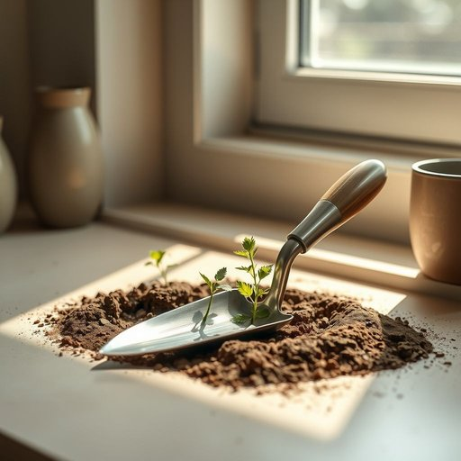

# trowel

<h1 style="font-size: 2.5em; font-weight: 300; letter-spacing: 2px; margin: 0; color: #2c3e50;">
/ˈtraʊwɛl/
</h1>

---

---

## 例句

Before you start planting the herbs by the kitchen window, make sure you grab the trowel from the shed, as it’s the only tool that combines a pointed blade for digging and a flat surface ideal for smoothing the soil around delicate seedlings.

*Before(/ˌbiˈfɔr/) you(/ju/) start(/stɑrt/) planting(/ˈplæntɪŋ/) the(/ðə/) herbs(/ərbz/) by(/baɪ/) the(/ðə/) kitchen(/ˈkɪʧən/) window,(/ˈwɪndoʊ,/) make(/meɪk/) sure(/ʃʊr/) you(/ju/) grab(/græb/) the(/ðə/) trowel(/ˈtraʊwɛl/) from(/frəm/) the(/ðə/) shed,(/ʃɛd,/) as(/ɛz/) it’s(/it’s*/) the(/ðə/) only(/ˈoʊnli/) tool(/tul/) that(/ðət/) combines(/kəmˈbaɪnz/) a(/ə/) pointed(/ˈpɔɪntɪd/) blade(/bleɪd/) for(/fər/) digging(/ˈdɪgɪŋ/) and(/ənd/) a(/ə/) flat(/flæt/) surface(/ˈsərfəs/) ideal(/aɪˈdil/) for(/fər/) smoothing(/sˈmuðɪŋ/) the(/ðə/) soil(/sɔɪl/) around(/əraʊnd/) delicate(/ˈdɛləkət/) seedlings.(/ˈsidlɪŋz./)*

**翻译：** 在你开始在厨房窗边种植香草之前，务必先从工具棚里取出镘刀，因为它是唯一一款集尖刃挖掘与平面抹平于一体，适合围绕娇嫩幼苗平整土壤的工具。

---

## 解释

英语单词‘trowel’作为名词，在家居生活用品的语境中主要指一种小型手工工具，通常由金属制成，带有平坦或略微弯曲的铲状部分和手柄，广泛用于抹灰、泥工或园艺中，例如涂抹灰泥、铺设砖石或种植花草时使用。英语学习者在使用‘trowel’时应注意其为可数名词，复数形式为‘trowels’，且常与动词搭配如‘use a trowel’（使用抹子）、‘hold a trowel’（拿着抹子）、‘apply with a trowel’（用抹子涂抹）等表达。此外，‘trowel’多出现在专业或具体的手工劳动语境中，不适用于泛指任何铲状工具。该词源自中古英语“trowel”，其根源可追溯至古法语“truelle”，进一步追溯至拉丁语“trochlea”，意指卷轴或旋转结构，反映了该工具早期的形状和功能特点。在中文语境中，‘trowel’常译为“抹子”或“泥刀”，强调其作为建筑工人抹灰、泥工操作中不可缺少的细工具角色，不带有褒贬色彩，属于中性词汇，主要体现其实用性和专业属性，适合用来描述家居装修、园艺施工等具体工作场合。

---

<small style="color: #999; font-size: 0.9em;">2025-07-17 06:22:41</small>

