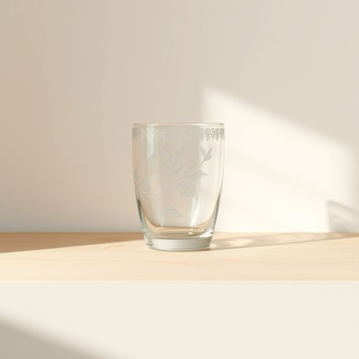

# tumbler

<h1 style="font-size: 2.5em; font-weight: 300; letter-spacing: 2px; margin: 0; color: #2c3e50;">
/ˈtəmblər/
</h1>

---

---

## 例句

Could you please put that delicate tumbler, which has the intricate floral pattern etched around its rim and is usually reserved for special occasions, back into the cupboard before it gets chipped while we're tidying up the kitchen together?

*Could(/kʊd/) you(/ju/) please(/pliz/) put(/pʊt/) that(/ðət/) delicate(/ˈdɛləkət/) tumbler,(/ˈtəmblər,/) which(/wɪʧ/) has(/həz/) the(/ðə/) intricate(/ˈɪntrəkət/) floral(/ˈflɔrəl/) pattern(/ˈpætərn/) etched(/ɛʧt/) around(/əraʊnd/) its(/ɪts/) rim(/rɪm/) and(/ənd/) is(/ɪz/) usually(/ˈjuʒəwəli/) reserved(/rɪˈzərvd/) for(/fər/) special(/ˈspɛʃəl/) occasions,(/ɔˈkeɪʒənz,/) back(/bæk/) into(/ˈɪntu/) the(/ðə/) cupboard(/ˈkəbərd/) before(/ˌbiˈfɔr/) it(/ɪt/) gets(/gɪts/) chipped(/ʧɪpt/) while(/waɪl/) we're(/wɪr/) tidying(/tidying*/) up(/əp/) the(/ðə/) kitchen(/ˈkɪʧən/) together?(/təˈgɛðər?/)*

**翻译：** 在我们一起收拾厨房的时候，能否请你把那个边缘刻有精致花纹、通常只在特殊场合使用的脆弱玻璃杯放回橱柜，以免它被磕碰损坏？

---

## 解释

英语单词“tumbler”在家居生活用品语境中作为名词，通常指一种无柄的圆柱形玻璃杯，常用于饮水或盛放冷饮，如水杯、果汁杯和软饮杯等，尤其在欧美家庭和餐馆中较为普遍，使用场合多为日常用餐、喝水或招待客人时。学习者在使用“tumbler”时应注意其不可数或可数的语法规则，通常表述为a tumbler或several tumblers，且常与drink、glass、water等词搭配，如“a tumbler of water”（一杯水）；此外，tumbler也可用作复数形式tumblers，表示多个玻璃杯。表达时应避免将其与带柄的“cup”混淆，因后者通常用于热饮且带有柄。词源方面，“tumbler”最初意指能够翻滚、翻转之物，源自中古英语“tumbler”，意为翻跟头的杂技演员，后因早期一种设计特殊、稳固且易翻转的玻璃杯而得名，渐渐专指无柄玻璃杯。在中文语境中，“tumbler”准确翻译为“无柄玻璃杯”或简称“玻璃杯”，强调其无柄和用于盛装冷饮的特性，区别于带柄的“杯子（cup）”。该词本身无褒贬色彩，属中性描述，文化内涵主要体现在西方餐具分类和生活习惯中，对应中文语境下的饮具类别，帮助学习者准确理解和区分不同类型的杯具。

---

<small style="color: #999; font-size: 0.9em;">2025-07-17 06:22:41</small>

