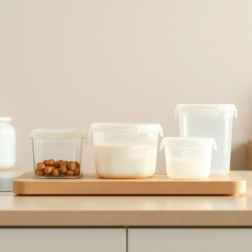

# tupperware

<h1 style="font-size: 2.5em; font-weight: 300; letter-spacing: 2px; margin: 0; color: #2c3e50;">
/ˈtəpərˌwɛr/
</h1>

---

---

## 例句

Could you please help me find the set of Tupperware containers that we used last weekend for the picnic, especially the ones with the airtight lids, because I need to pack the leftovers from dinner before they spoil in the fridge?

*Could(/kʊd/) you(/ju/) please(/pliz/) help(/hɛlp/) me(/mi/) find(/faɪnd/) the(/ðə/) set(/sɛt/) of(/əv/) Tupperware(/ˈtəpərˌwɛr/) containers(/kənˈteɪnərz/) that(/ðət/) we(/wi/) used(/juzd/) last(/læst/) weekend(/ˈwiˌkɪnd/) for(/fər/) the(/ðə/) picnic,(/ˈpɪkˌnɪk,/) especially(/əˈspɛʃəli/) the(/ðə/) ones(/wənz/) with(/wɪθ/) the(/ðə/) airtight(/ˈɛrˌtaɪt/) lids,(/lɪdz,/) because(/bɪˈkəz/) I(/aɪ/) need(/nid/) to(/tɪ/) pack(/pæk/) the(/ðə/) leftovers(/ˈlɛfˌtoʊvərz/) from(/frəm/) dinner(/ˈdɪnər/) before(/ˌbiˈfɔr/) they(/ðeɪ/) spoil(/spɔɪl/) in(/ɪn/) the(/ðə/) fridge?(/frɪʤ?/)*

**翻译：** 你能帮我找到我们上周末野餐时用的那套带密封盖的Tupperware保鲜盒吗？我需要用它们把晚饭的剩菜装起来，避免放冰箱时变质。

---

## 解释

“tupperware”作为名词，指的是一种由食品级塑料制成的密封储存容器，常用于保存剩余食物、防止食物变质，广泛出现在家庭厨房和餐桌环境中。具体使用场合多为家庭日常储藏、带饭盒、冷藏保鲜等语境，如“Put the leftovers in a Tupperware”表示“把剩饭放进保鲜盒里”。英语学习者使用该词时需注意“Tupperware”通常大写，因为它是品牌名称，但在口语中也逐渐泛指任何类似的塑料储物容器，因此当泛指时小写tupperware也可被接受。常见搭配有“a Tupperware container”，“Tupperware party”等，其中“party”指美国家庭销售和交流这种产品的社交活动。词源方面，“Tupperware”由其发明者厄尔·塔珀（Earl Tupper）于20世纪40年代创立的品牌名称，最初为专利注册商标，后因产品广泛流行，逐渐成为塑料密封盒的代名词。中文语境中，“Tupperware”一般译为“特百惠”或“特普威尔”，即其品牌音译，同时在日常用语中常直接译为“保鲜盒”或“塑料密封盒”，强调其实用功能。该词本身无褒贬含义，但作为品牌名带有一定的品质和信赖感，体现现代家庭厨具方便、环保的生活理念。

---

<small style="color: #999; font-size: 0.9em;">2025-07-17 06:22:41</small>

