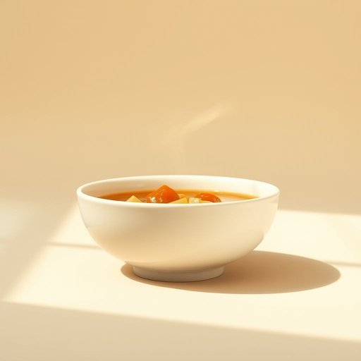

# tureen

<h1 style="font-size: 2.5em; font-weight: 300; letter-spacing: 2px; margin: 0; color: #2c3e50;">
/tureen*/
</h1>

---

---

## 例句

After carefully placing the steaming stew into the ornate tureen, which had been handed down through generations and featured delicate floral engravings, she carried it to the dining table where her family eagerly awaited a hearty meal while the autumn rain softly pattered against the windowpane.

*After(/ˈæftər/) carefully(/ˈkɛrfəli/) placing(/ˈpleɪsɪŋ/) the(/ðə/) steaming(/ˈstimɪŋ/) stew(/stu/) into(/ˈɪntu/) the(/ðə/) ornate(/ɔrˈneɪt/) tureen,(/tureen*,/) which(/wɪʧ/) had(/hæd/) been(/bɪn/) handed(/ˈhændɪd/) down(/daʊn/) through(/θru/) generations(/ˌʤɛnərˈeɪʃənz/) and(/ənd/) featured(/ˈfiʧərd/) delicate(/ˈdɛləkət/) floral(/ˈflɔrəl/) engravings,(/ɪnˈgreɪvɪŋz,/) she(/ʃi/) carried(/ˈkɛrid/) it(/ɪt/) to(/tɪ/) the(/ðə/) dining(/ˈdaɪnɪŋ/) table(/ˈteɪbəl/) where(/wɛr/) her(/hər/) family(/ˈfæməli/) eagerly(/ˈigərli/) awaited(/əˈweɪtɪd/) a(/ə/) hearty(/ˈhɑrti/) meal(/mil/) while(/waɪl/) the(/ðə/) autumn(/ˈɔtəm/) rain(/reɪn/) softly(/ˈsɔftli/) pattered(/ˈpætərd/) against(/əˈgɛnst/) the(/ðə/) windowpane.(/ˈwɪndoʊˌpeɪn./)*

**翻译：** 她小心翼翼地将冒着热气的炖菜盛入那只代代相传、饰有精致花纹的华丽汤碗中，端到餐桌旁。此时，家人们正满怀期待地等待着丰盛的晚餐，而秋雨则轻轻敲打着窗棂。

---

## 解释

英语单词'tureen'在家居生活用品语境中作为名词，指的是一种带盖、大而深的瓷器或陶器，专门用来盛装汤品，通常用于正式的餐桌上以便分装汤类。它常见于宴会、节日聚餐或正式晚餐等场合，体现出一定的餐饮礼仪和精致感。英语学习者在使用tureen时应注意它是可数名词，通常与介词如“of”搭配，表示“盛装的内容物”，例如“a tureen of soup”，此外，tureen常与形容词如“large,”“ceramic,”“porcelain”搭配使用以描述材质和大小。语法上，tureen一般用单数形式出现，但在描述多套餐具时可使用复数形式“tureens”。词源方面，tureen源自法语“terrine”，原指一种陶罐，后来演变为专指汤盘，体现了其欧洲尤其是法国饮食文化中的传统地位。在中文语境中，tureen准确翻译为“汤盅”或“汤缸”，强调其盛装汤品的功能和器具的形态，但不同于普通汤碗，通常规格较大且配有盖子，体现出一定的档次和礼仪色彩。该词无褒贬含义，但在使用时多带有正式和高雅的文化内涵，常出现在描述高档餐具或宴会场合的语境中。

---

<small style="color: #999; font-size: 0.9em;">2025-07-17 06:22:41</small>

