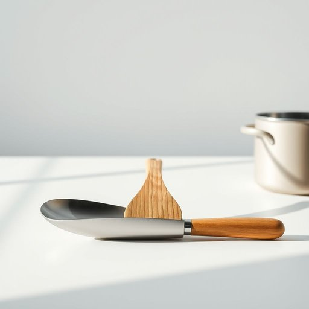

# turner

<h1 style="font-size: 2.5em; font-weight: 300; letter-spacing: 2px; margin: 0; color: #2c3e50;">
/ˈtərnər/
</h1>

---

---

## 例句

Could you please pass me the turner that’s sitting next to the frying pan on the counter, the one with the wooden handle and slightly curved edge, so I can flip these pancakes without breaking them?

*Could(/kʊd/) you(/ju/) please(/pliz/) pass(/pæs/) me(/mi/) the(/ðə/) turner(/ˈtərnər/) that’s(/that’s*/) sitting(/ˈsɪtɪŋ/) next(/nɛkst/) to(/tɪ/) the(/ðə/) frying(/fraɪɪŋ/) pan(/pæn/) on(/ɔn/) the(/ðə/) counter,(/ˈkaʊntər,/) the(/ðə/) one(/wən/) with(/wɪθ/) the(/ðə/) wooden(/ˈwʊdən/) handle(/ˈhændəl/) and(/ənd/) slightly(/sˈlaɪtli/) curved(/kərvd/) edge,(/ɛʤ,/) so(/soʊ/) I(/aɪ/) can(/kən/) flip(/flɪp/) these(/ðiz/) pancakes(/ˈpænˌkeɪks/) without(/wɪˈθaʊt/) breaking(/ˈbreɪkɪŋ/) them?(/ðɛm?/)*

**翻译：** 请把放在厨房台面煎锅旁边那个带木质手柄、边缘略微弯曲的铲子递给我，好让我翻动这些煎饼而不弄碎它们。

---

## 解释

英语单词“turner”在家居生活用品的语境中通常指厨房用的“铲子”或“煎铲”，是一种用于翻动食物（如煎蛋、煎饼、肉饼等）的烹饪工具，具体使用场合多见于烹饪过程中，例如从锅中翻转食物或将食物从锅中铲起。英语学习者在使用“turner”时要注意其作为名词时通常为可数形式，前面可加冠词如a turner或the turner，在搭配上常见如“metal turner”（金属铲子）、“plastic turner”（塑料铲子）等，并且常与动词“use”（使用）、“pick up”（夹取）等连用。词源方面，“turner”源自动词“turn”，表示“翻转”，加上名词后缀“-er”指代执行翻转动作的工具或人，即“用来翻转东西的工具”；在工匠行业中，“turner”也可指车床工，但在家居用品语境中明确指厨房铲，中文译为“铲子”、“煎铲”较为准确，强调的是其在烹饪时翻转食物的功能，无褒贬色彩，属于中性且常用的厨房用具术语，在理解时应注意其功能性和用途，而非泛指任何铲状工具，以避免语义混淆。

---

<small style="color: #999; font-size: 0.9em;">2025-07-17 06:22:41</small>

