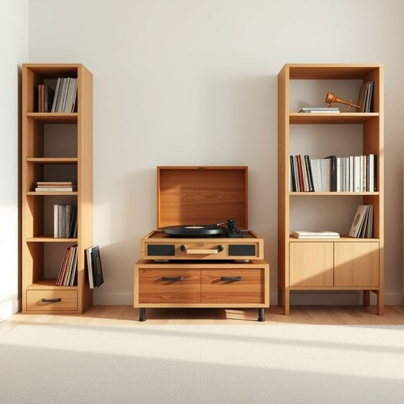

# turntable

<h1 style="font-size: 2.5em; font-weight: 300; letter-spacing: 2px; margin: 0; color: #2c3e50;">
/ˈtərnˌteɪbəl/
</h1>

---

---

## 例句

Although the modern living room is filled with sleek digital devices, my grandfather insists on keeping his vintage turntable by the bookshelf, not only because it produces a richer sound when playing vinyl records, but also because it serves as a nostalgic centerpiece that reminds the family of simpler times spent sharing music together.

*Although(/ˌɔlˈðoʊ/) the(/ðə/) modern(/ˈmɑdərn/) living(/ˈlɪvɪŋ/) room(/rum/) is(/ɪz/) filled(/fɪld/) with(/wɪθ/) sleek(/slik/) digital(/ˈdɪʤɪtəl/) devices,(/dɪˈvaɪsɪz,/) my(/maɪ/) grandfather(/ˈgrænˌfɑðər/) insists(/ˌɪnˈsɪsts/) on(/ɔn/) keeping(/ˈkipɪŋ/) his(/hɪz/) vintage(/ˈvɪntɪʤ/) turntable(/ˈtərnˌteɪbəl/) by(/baɪ/) the(/ðə/) bookshelf,(/ˈbʊkˌʃɛlf,/) not(/nɑt/) only(/ˈoʊnli/) because(/bɪˈkəz/) it(/ɪt/) produces(/prəˈdusɪz/) a(/ə/) richer(/ˈrɪʧər/) sound(/saʊnd/) when(/wɪn/) playing(/pleɪɪŋ/) vinyl(/ˈvaɪnəl/) records,(/ˈrɛkərdz,/) but(/bət/) also(/ˈɔlsoʊ/) because(/bɪˈkəz/) it(/ɪt/) serves(/sərvz/) as(/ɛz/) a(/ə/) nostalgic(/nɔˈstælʤɪk/) centerpiece(/ˈsɛntərˌpis/) that(/ðət/) reminds(/riˈmaɪndz/) the(/ðə/) family(/ˈfæməli/) of(/əv/) simpler(/ˈsɪmpələr/) times(/taɪmz/) spent(/spɛnt/) sharing(/ˈʃɛrɪŋ/) music(/mˈjuzɪk/) together.(/təˈgɛðər./)*

**翻译：** 虽然现代客厅里布满了时尚的电子设备，但我祖父坚持把他那台复古唱机放在书架旁，不仅因为它播放黑胶唱片时声音更加醇厚，更因为它作为一个充满怀旧情怀的核心物件，提醒全家人那些曾一起分享音乐的纯朴时光。

---

## 解释

turntable作为名词在家居生活用品语境中主要指一种旋转平台，最常见的形式是唱盘，尤其用于黑胶唱片的播放设备，即唱盘或转盘。具体使用场合通常是在家庭娱乐或音响设备中，指放置并旋转黑胶唱片的部件，使唱针能够读取声音；此外，在厨房中也有旋转托盘的用法，如餐桌上的旋转盘（懒人转盘）以便共享菜肴。英语学习者使用该词时应注意它是可数名词，通常与形容词连用如a vintage turntable（一台复古唱盘）、a rotating turntable（一个旋转转盘），表达时可用turntable for records明确具体种类。该词来源于turn（转动）和table（桌子、平台）组成的复合词，反映其核心功能为可旋转的平台。在中文语境中，turntable最准确的翻译是唱盘，在不同家庭用途中也可译为转盘或旋转托盘，避免直接译为转台以免引起误解。此词在英语中无明显褒贬色彩，文化内涵较为中性，但作为黑胶唱片播放器核心组件，常带有复古、音质纯正的美学意味，受到音乐发烧友的青睐。

---

<small style="color: #999; font-size: 0.9em;">2025-07-17 06:22:41</small>

