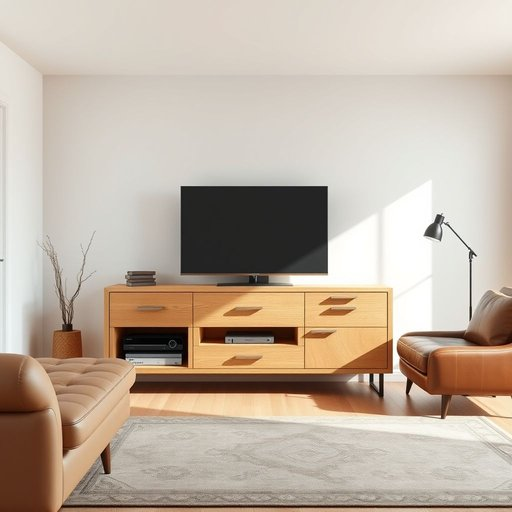

# tv-stand

<h1 style="font-size: 2.5em; font-weight: 300; letter-spacing: 2px; margin: 0; color: #2c3e50;">
/tv-stand*/
</h1>

---

---

## 例句

After debating for hours whether to go for a minimalist look or something more traditional, we finally decided that the oak-finished TV stand, which not only offers ample storage for DVDs and gaming consoles but also complements the leather sofa and vintage rug in the living room, would be the perfect addition to enhance both the functionality and aesthetic appeal of the space.

*After(/ˈæftər/) debating(/dəˈbeɪtɪŋ/) for(/fər/) hours(/aʊərz/) whether(/ˈwɛðər/) to(/tɪ/) go(/goʊ/) for(/fər/) a(/ə/) minimalist(/ˈmɪnəməlɪst/) look(/lʊk/) or(/ər/) something(/ˈsəmθɪŋ/) more(/mɔr/) traditional,(/trəˈdɪʃənəl,/) we(/wi/) finally(/ˈfaɪnəli/) decided(/ˌdɪˈsaɪdɪd/) that(/ðət/) the(/ðə/) oak-finished(/oak-finished*/) TV(/ˌtɛləˈvɪʒən/) stand,(/stænd,/) which(/wɪʧ/) not(/nɑt/) only(/ˈoʊnli/) offers(/ˈɔfərz/) ample(/ˈæmpəl/) storage(/ˈstɔrɪʤ/) for(/fər/) DVDs(/ˌdiˌviˈdiz/) and(/ənd/) gaming(/ˈgeɪmɪŋ/) consoles(/kənˈsoʊlz/) but(/bət/) also(/ˈɔlsoʊ/) complements(/ˈkɑmpləmənts/) the(/ðə/) leather(/ˈlɛðər/) sofa(/ˈsoʊfə/) and(/ənd/) vintage(/ˈvɪntɪʤ/) rug(/rəg/) in(/ɪn/) the(/ðə/) living(/ˈlɪvɪŋ/) room,(/rum,/) would(/wʊd/) be(/bi/) the(/ðə/) perfect(/ˈpərˌfɪkt/) addition(/əˈdɪʃən/) to(/tɪ/) enhance(/ɛnˈhæns/) both(/boʊθ/) the(/ðə/) functionality(/ˌfəŋkʃəˈnælɪti/) and(/ənd/) aesthetic(/ɛsˈθɛtɪk/) appeal(/əˈpil/) of(/əv/) the(/ðə/) space.(/speɪs./)*

**翻译：** 经过长时间的讨论，我们在极简风格与传统风格之间权衡，最终决定选择这款橡木饰面的电视柜。它不仅为DVD和游戏机提供了充足的储存空间，还与客厅的皮沙发和复古地毯相得益彰，成为提升空间功能性与美感的完美之选。

---

## 解释

tv-stand作为名词，主要指放置电视机的家具，通常是专门设计用来支撑电视机并可能带有储物功能的柜子或架子。这一词汇常见于家居生活用品领域，使用场合多出现在家庭、客厅或办公室等环境中，描述电视设备的安置位置及相关家具布局。在语法使用上，tv-stand一般作可数名词，常用复数形式tv-stands，例如The living room has two tv-stands。在搭配上，常见表达有wooden tv-stand（木制电视柜）、modern tv-stand（现代电视柜）、corner tv-stand（角落电视柜）等，学习者需注意它通常与材质、风格或位置等形容词搭配使用。词源方面，tv-stand由TV即television（电视机）的简称与stand（支架、架子）组合而成，直接描述其功能，即用来放电视的支架或座架，不带有特殊隐喻或引申义。中文里tv-stand常译为电视柜或电视机柜，强调其作为家具和功能性的定位，准确传达其用来摆放电视机并可能存放其他物品的作用。总体而言，该词语是中性词，不含褒贬色彩，也无特殊文化内涵，适合用作标准日常生活中描述家居设施的专业或通俗用语。

---

<small style="color: #999; font-size: 0.9em;">2025-07-17 06:22:41</small>

