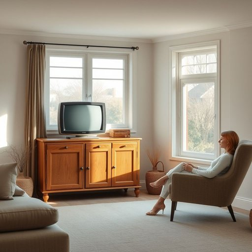

# tv

<h1 style="font-size: 2.5em; font-weight: 300; letter-spacing: 2px; margin: 0; color: #2c3e50;">
/ˌtɛləˈvɪʒən/
</h1>

---

---

## 例句

After tidying up the living room, where the old, slightly scratched tv sat on the vintage oak cabinet beneath the large bay window that flooded the space with natural light, she finally settled into the cosy armchair, ready to watch the evening news that her partner had been insisting was crucial for staying informed about the local council’s new recycling policies.

*After(/ˈæftər/) tidying(/tidying*/) up(/əp/) the(/ðə/) living(/ˈlɪvɪŋ/) room,(/rum,/) where(/wɛr/) the(/ðə/) old,(/oʊld,/) slightly(/sˈlaɪtli/) scratched(/skræʧt/) tv(/ˌtɛləˈvɪʒən/) sat(/sæt/) on(/ɔn/) the(/ðə/) vintage(/ˈvɪntɪʤ/) oak(/oʊk/) cabinet(/ˈkæbənət/) beneath(/bɪˈniθ/) the(/ðə/) large(/lɑrʤ/) bay(/beɪ/) window(/ˈwɪndoʊ/) that(/ðət/) flooded(/ˈflədɪd/) the(/ðə/) space(/speɪs/) with(/wɪθ/) natural(/ˈnæʧərəl/) light,(/laɪt,/) she(/ʃi/) finally(/ˈfaɪnəli/) settled(/ˈsɛtəld/) into(/ˈɪntu/) the(/ðə/) cosy(/ˈkoʊzi/) armchair,(/ˈɑrmˌʧɛr,/) ready(/ˈrɛdi/) to(/tɪ/) watch(/wɔʧ/) the(/ðə/) evening(/ˈivnɪŋ/) news(/nuz/) that(/ðət/) her(/hər/) partner(/ˈpɑrtnər/) had(/hæd/) been(/bɪn/) insisting(/ˌɪnˈsɪstɪŋ/) was(/wɑz/) crucial(/ˈkruʃəl/) for(/fər/) staying(/steɪɪŋ/) informed(/ˌɪnˈfɔrmd/) about(/əˈbaʊt/) the(/ðə/) local(/ˈloʊkəl/) council’s(/council’s*/) new(/nu/) recycling(/riˈsaɪkəlɪŋ/) policies.(/ˈpɑləsiz./)*

**翻译：** 整理好客厅后，那台略显划痕的旧电视静静地放置在大飘窗下那张复古橡木柜子上，阳光透过窗户洒满整个空间。她终于安坐在舒适的扶手椅中，准备观看伴侣一直坚持认为对了解地方议会新回收政策至关重要的晚间新闻。

---

## 解释

“tv”作为名词时，主要指家庭生活中用于接收和播放广播电视节目的一种电子设备，即电视机。它通常出现在描述家居环境、娱乐活动或电子产品的语境中，比如“watching TV”（看电视）、“turn on the TV”（打开电视）、“TV show”（电视节目）等表达。英语学习者在使用“tv”时应注意，它是名词，通常作为可数名词使用，但日常口语中多以不可数形式出现，表示电视整体或电视作为一种媒介。此外，“TV”作为缩写词，首字母大写时更正式，尤其出现在文书或标题中，而口语和非正式书写中常用小写“tv”。其常见搭配包括“TV set”表示电视机设备，“TV channel”指电视频道，“TV screen”指电视屏幕等。词源上，“TV”是“television”的缩写，后者来源于希腊语“tele-”（远的）和拉丁语“visio”（视觉），反映出通过电子手段远距离传送视觉影像的技术。中文语境中，“tv”准确翻译为“电视”或“电视机”，强调的是设备本身或通过该设备观看的电视内容。在文化色彩方面，词语本身无明显褒贬含义，但“watching too much TV”可能带有负面含义，暗示过度观看影响生活。此外，“TV”在现代家庭中常作为休闲娱乐和信息获取的重要工具，具有广泛的社会文化意义。

---

<small style="color: #999; font-size: 0.9em;">2025-07-17 06:22:41</small>

