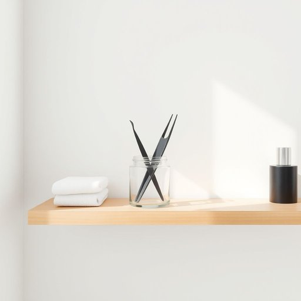

# tweezers

<h1 style="font-size: 2.5em; font-weight: 300; letter-spacing: 2px; margin: 0; color: #2c3e50;">
/tˈwizərz/
</h1>

---

---

## 例句

Could you please hand me the tweezers that are kept in the small glass jar on the bathroom shelf, the ones with the slanted tips and rubber grips, because I need to carefully remove this tiny splinter that’s been bothering me all afternoon?

*Could(/kʊd/) you(/ju/) please(/pliz/) hand(/hænd/) me(/mi/) the(/ðə/) tweezers(/tˈwizərz/) that(/ðət/) are(/ər/) kept(/kɛpt/) in(/ɪn/) the(/ðə/) small(/smɔl/) glass(/glæs/) jar(/ʤɑr/) on(/ɔn/) the(/ðə/) bathroom(/ˈbæθˌrum/) shelf,(/ʃɛlf,/) the(/ðə/) ones(/wənz/) with(/wɪθ/) the(/ðə/) slanted(/sˈlænɪd/) tips(/tɪps/) and(/ənd/) rubber(/ˈrəbər/) grips,(/grɪps,/) because(/bɪˈkəz/) I(/aɪ/) need(/nid/) to(/tɪ/) carefully(/ˈkɛrfəli/) remove(/riˈmuv/) this(/ðɪs/) tiny(/ˈtaɪni/) splinter(/ˈsplɪntər/) that’s(/that’s*/) been(/bɪn/) bothering(/ˈbɑðərɪŋ/) me(/mi/) all(/ɔl/) afternoon?(/ˌæftərˈnun?/)*

**翻译：** 请把浴室架子上那个小玻璃罐里的镊子递给我，就是那种斜头且带橡胶握柄的，因为我需要小心地取出这个整个下午一直困扰我的细小刺片。

---

## 解释

英语单词"tweezers"作为名词，指一种小型的夹取工具，通常由两根金属条通过一端连接，使用时用手指挤压使两端合拢，广泛应用于家庭生活中的细小物品夹取，如拔除眉毛、取出鱼刺或夹取微小零件。在具体使用场合和语境上，"tweezers"常见于个人护理、化妆和医疗卫生等情境中，如“use tweezers to pluck eyebrows”（用镊子拔眉毛）或“sterilize the tweezers before use”（使用前消毒镊子）。英语学习者使用此词时需注意，tweezers是复数形式名词，通常不用于单数（单数为tweezer较少见且不常用），且常与动词搭配使用，如“hold tweezers”，“use tweezers”，“clean tweezers”等。此外，"tweezers"作为具体工具名词，习惯上不加冠词时多指泛指，也可用于具体情境下加定冠词或不定冠词。词源上，"tweezers"源自法语单词"pince"，意为夹子，这一工具概念在欧洲多国均有类似表达，英语中tweezers于18世纪末逐渐普及，反映出精细夹持工具的实用价值。在中文语境中，“tweezers”准确翻译为“镊子”或“镊子钳”，强调工具的细微与精确操作属性，该词在生活用语中没有褒贬含义，也无特殊文化色彩，仅表示一种常见且实用的生活小工具，适用于护理美容及日常细节处理，正确理解和使用有助于提升语言表达的准确性和生活知识的实用性。

---

<small style="color: #999; font-size: 0.9em;">2025-07-17 06:22:41</small>

