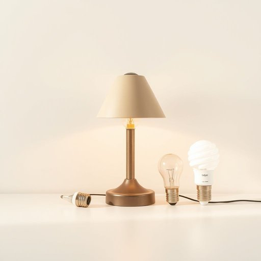

# type

<h1 style="font-size: 2.5em; font-weight: 300; letter-spacing: 2px; margin: 0; color: #2c3e50;">
/taɪp/
</h1>

---

---

## 例句

Could you please check which type of light bulb fits this vintage lamp, as I’m not sure whether it requires the standard screw-in kind or those newer, energy-efficient bayonet types that are a bit trickier to install?

*Could(/kʊd/) you(/ju/) please(/pliz/) check(/ʧɛk/) which(/wɪʧ/) type(/taɪp/) of(/əv/) light(/laɪt/) bulb(/bəlb/) fits(/fɪts/) this(/ðɪs/) vintage(/ˈvɪntɪʤ/) lamp,(/læmp,/) as(/ɛz/) I’m(/i’m*/) not(/nɑt/) sure(/ʃʊr/) whether(/ˈwɛðər/) it(/ɪt/) requires(/rikˈwaɪərz/) the(/ðə/) standard(/ˈstændərd/) screw-in(/screw-in*/) kind(/kaɪnd/) or(/ər/) those(/ðoʊz/) newer,(/nuər,/) energy-efficient(/energy-efficient*/) bayonet(/ˈbeɪəˌnɛt/) types(/taɪps/) that(/ðət/) are(/ər/) a(/ə/) bit(/bɪt/) trickier(/ˈtrɪkiər/) to(/tɪ/) install?(/ˌɪnˈstɔl?/)*

**翻译：** 您能帮忙确认一下这款复古台灯适合安装哪种类型的灯泡吗？我不太确定它是用标准的螺旋式灯泡，还是那种较新、节能且安装稍显复杂的旋钮式灯泡。

---

## 解释

在家居生活用品的语境中，英语单词“type”作为名词主要指某一类、某种或某种类别的物品，比如“type of furniture”（家具种类）、“type of appliance”（电器类型）等，常用于区分不同风格、功能或品牌的产品。具体使用场合通常涉及对物品的分类描述，例如在购买、推荐或介绍家居用品时，表达“这是一种现代风格的灯具”或“这种类型的沙发适合小户型”时都会用到“type”。学习者在使用该词时需要注意，“type”作为可数名词，可以加复数形式“types”，且通常后面跟介词“of”引出具体种类，如“types of chairs”。此外，“type”作为名词强调类别属性，而非具体的物品编号；不能直接接复数形式的限定词如“this types”，正确表达为“this type”。常见搭配包括“type of + 名词”、“different types of + 名词”等，用来表达多样性或类别区别。词源上，“type”源自希腊语“typos”，意指模型、印模或典型形象，经过拉丁语进入英语，逐渐演变为表示“范型”、“种类”“类型”的含义，这与手工业或印刷制版中的“模版”意义有关。在中文语境中，准确理解“type”为“类型”、“种类”或“款式”，强调归属的类目或类别属性。该词一般中性，不含褒义或贬义，使用时主要依据具体语境区分具体类别，没有特殊的文化内涵，只需注意表达准确与搭配规范即可。

---

<small style="color: #999; font-size: 0.9em;">2025-07-17 06:22:41</small>

