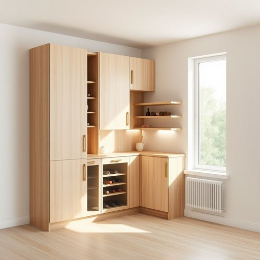

# unit

<h1 style="font-size: 2.5em; font-weight: 300; letter-spacing: 2px; margin: 0; color: #2c3e50;">
/ˈjunɪt/
</h1>

---

---

## 例句

The new kitchen unit, which we carefully chose for its combination of sleek design and ample storage space, not only fits perfectly into the corner next to the window but also includes a built-in wine rack and adjustable shelves, making it an essential piece for organizing all our cooking utensils and pantry items efficiently.

*The(/ðə/) new(/nu/) kitchen(/ˈkɪʧən/) unit,(/ˈjunɪt,/) which(/wɪʧ/) we(/wi/) carefully(/ˈkɛrfəli/) chose(/ʧoʊz/) for(/fər/) its(/ɪts/) combination(/ˌkɑmbəˈneɪʃən/) of(/əv/) sleek(/slik/) design(/dɪˈzaɪn/) and(/ənd/) ample(/ˈæmpəl/) storage(/ˈstɔrɪʤ/) space,(/speɪs,/) not(/nɑt/) only(/ˈoʊnli/) fits(/fɪts/) perfectly(/ˈpərfəktli/) into(/ˈɪntu/) the(/ðə/) corner(/ˈkɔrnər/) next(/nɛkst/) to(/tɪ/) the(/ðə/) window(/ˈwɪndoʊ/) but(/bət/) also(/ˈɔlsoʊ/) includes(/ˌɪnˈkludz/) a(/ə/) built-in(/ˈbɪlˌtɪn/) wine(/waɪn/) rack(/ræk/) and(/ənd/) adjustable(/əˈʤəstəbəl/) shelves,(/ʃɛlvz,/) making(/ˈmeɪkɪŋ/) it(/ɪt/) an(/ən/) essential(/ɛˈsɛnʃəl/) piece(/pis/) for(/fər/) organizing(/ˈɔrgəˌnaɪzɪŋ/) all(/ɔl/) our(/ɑr/) cooking(/ˈkʊkɪŋ/) utensils(/juˈtɛnsəlz/) and(/ənd/) pantry(/ˈpæntri/) items(/ˈaɪtəmz/) efficiently.(/ɪˈfɪʃəntli./)*

**翻译：** 我们精心挑选的新厨房柜，因其时尚的设计与充足的储物空间而备受青睐，不仅完美契合窗边的角落，还配备了内置酒架和可调节的搁板，是高效整理所有烹饪用具与储藏物品的必备之选。

---

## 解释

在家居生活用品的语境中，英语名词“unit”通常指的是成套或独立的家具装置，如厨房橱柜单元、储物柜单元或者洗衣机和烘干机的组合单元等，具体使用场合多见于描述家居布局、家具组合或者电器设备时，强调其作为一个整体或功能单元的性质。学习者在使用“unit”时需注意其多义性，作为名词时常见用法包括表示“单个部分”或“单元”，且常与家具或家电类型连用，如“kitchen unit”（厨房柜）、“storage unit”（储物柜）、“unit price”（单价）等，语法上“unit”作为可数名词通常带有复数形式units，且常通过定语修饰限定其种类和功能。该词源自拉丁语“unitas”，意指“统一、一体”，通过法语“unité”进入英语，强调的是整体的统一性和功能的独立性。中文对应的准确翻译包括“单元”、“单体”、“组合件”或“装置”，具体视上下文而定，一般指一个相对完整且功能独立的家具或设备部分。在中文语境下，使用“unit”强调的是一个可以单独计量、识别或使用的家居部分，既可以指小的组件，也可以指成套的装置，通常无褒贬色彩，属于中性词，文化上没有特殊的文化内涵，只是在描述家居布局和功能配置时使用频率较高。

---

<small style="color: #999; font-size: 0.9em;">2025-07-17 06:22:41</small>

