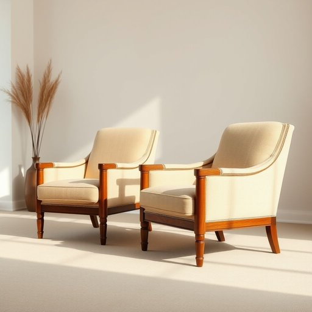

# upholstery

<h1 style="font-size: 2.5em; font-weight: 300; letter-spacing: 2px; margin: 0; color: #2c3e50;">
/əˈpoʊlstəri/
</h1>

---

---

## 例句

After spending weeks debating whether to redecorate the living room entirely or just update the worn upholstery on the antique armchairs, we finally decided to hire a specialist who could expertly match the fabric’s colour and texture to complement our existing décor, ensuring the room retains its cozy yet elegant atmosphere.

*After(/ˈæftər/) spending(/ˈspɛndɪŋ/) weeks(/wiks/) debating(/dəˈbeɪtɪŋ/) whether(/ˈwɛðər/) to(/tɪ/) redecorate(/riˈdɛkərˌeɪt/) the(/ðə/) living(/ˈlɪvɪŋ/) room(/rum/) entirely(/ɪnˈtaɪərli/) or(/ər/) just(/ʤɪst/) update(/ˈəpˌdeɪt/) the(/ðə/) worn(/wɔrn/) upholstery(/əˈpoʊlstəri/) on(/ɔn/) the(/ðə/) antique(/ænˈtik/) armchairs,(/ˈɑrmˌʧɛrz,/) we(/wi/) finally(/ˈfaɪnəli/) decided(/ˌdɪˈsaɪdɪd/) to(/tɪ/) hire(/haɪər/) a(/ə/) specialist(/ˈspɛʃəlɪst/) who(/hu/) could(/kʊd/) expertly(/ˈɛkspərtli/) match(/mæʧ/) the(/ðə/) fabric’s(/fabric’s*/) colour(/ˈkələr/) and(/ənd/) texture(/ˈtɛksʧər/) to(/tɪ/) complement(/ˈkɑmpləmənt/) our(/ɑr/) existing(/ɪgˈzɪstɪŋ/) décor,(/décor*,/) ensuring(/ɪnˈʃʊrɪŋ/) the(/ðə/) room(/rum/) retains(/rɪˈteɪnz/) its(/ɪts/) cozy(/ˈkoʊzi/) yet(/jɛt/) elegant(/ˈɛləgənt/) atmosphere.(/ˈætməsˌfɪr./)*

**翻译：** 经过数周的讨论，究竟是重新装饰整个客厅，还是仅仅更换古董扶手椅上磨损的布料，我们最终决定聘请一位专家，精心匹配面料的颜色和质地，以衬托现有的装饰风格，确保房间既保持温馨又不失优雅的氛围。

---

## 解释

英语单词"upholstery"作为名词，主要指家具表面用来覆盖和装饰的软垫材料，如布料、皮革、海绵等，通常应用于沙发、椅子、座椅等家居生活用品中。在具体使用场合和语境中，"upholstery"多出现在描述家具制造、维修或美容时，如“the upholstery of the sofa needs cleaning”表示“沙发的软垫需要清洗”。英语学习者在使用该词时要注意，它是不可数名词，通常不加复数形式，也常与“upholstery fabric”（软垫面料）、“upholstery work”（家具装修工作）等短语搭配。此外，"upholster"是其动词形式，指“装饰或修理家具软垫”，与之相关连。词源上，"upholstery"源自中古英语"uphold"（支撑、支撑物）与后缀"-ery"的结合，最早指家具中的填充及覆盖物，体现了其支持和装饰的功能。中文中，"upholstery"通常译为“家具软垫”或“装饰软垫”，准确传达其“用于家具表面覆盖和装饰的软质材料”这一含义，无贬褒色彩，纯粹为技术性词汇，强调功能和材质。整体来看，该词在家居领域的使用频率较高，表达明确，文化内涵主要与舒适和美观相关，适用于专业和日常对话中描述家具外观与质感的场合。

---

<small style="color: #999; font-size: 0.9em;">2025-07-17 06:22:41</small>

