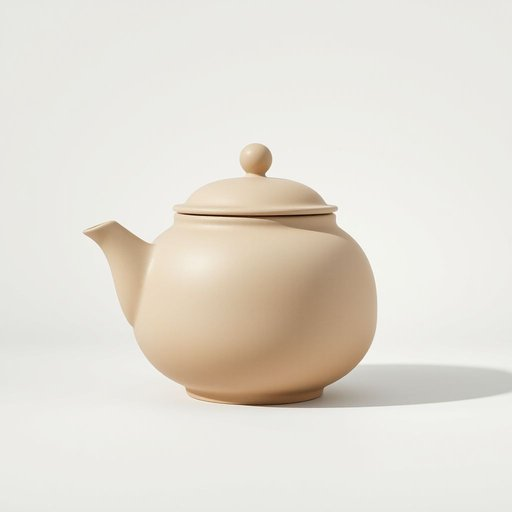

# urn

<h1 style="font-size: 2.5em; font-weight: 300; letter-spacing: 2px; margin: 0; color: #2c3e50;">
/ərn/
</h1>

---

---

## 例句

The ancient urn, meticulously carved with intricate patterns, stood in the museum's main hall as a testament to the civilization's artistry and history, captivating visitors with its silent narrative of time and culture.

*The(/ðə/) ancient(/ˈeɪnʧənt/) urn,(/ərn,/) meticulously(/məˈtɪkjələsli/) carved(/kɑrvd/) with(/wɪθ/) intricate(/ˈɪntrəkət/) patterns,(/ˈpætərnz,/) stood(/stʊd/) in(/ɪn/) the(/ðə/) museum's(/mjuˈziəmz/) main(/meɪn/) hall(/hɔl/) as(/ɛz/) a(/ə/) testament(/ˈtɛstəmənt/) to(/tɪ/) the(/ðə/) civilization's(/civilization's*/) artistry(/ˈɑrtɪstri/) and(/ənd/) history,(/ˈhɪstəri,/) captivating(/ˈkæptɪˌveɪtɪŋ/) visitors(/ˈvɪzɪtərz/) with(/wɪθ/) its(/ɪts/) silent(/ˈsaɪlənt/) narrative(/ˈnɛrətɪv/) of(/əv/) time(/taɪm/) and(/ənd/) culture.(/ˈkəlʧər./)*

**翻译：** 那尊古老的瓮器上雕刻着精美细腻的纹饰，静静伫立于博物馆主厅，见证着文明的艺术造诣与历史风华，以其无声的时光和文化叙事深深吸引着来访者。

---

## 解释

“urn”作为名词在家居生活用品的英语语境中，通常指带有盖子的较大容器，常用于盛装热饮（水、茶、咖啡）或储存液体，如饮水机或热水壶的容器，使用场合多见于家庭聚会、办公场所或公共饮水区，尤其指那种可以保温的水壶或容器。英语学习者使用“urn”时需注意其单数和复数形式，复数为“urns”，且常与表示液体的动词连用，如“fill the urn with hot water”（把壶装满热水），“brew coffee in an urn”（用壶煮咖啡）。常见搭配包括“coffee urn”（咖啡壶）、“tea urn”（茶壶）、“water urn”（饮水锅），这些表达强调其作为容器的功能。词源上，“urn”来源于拉丁语“urna”，最初指古代用来盛放骨灰或液体的陶罐，随着时间演变为现代带盖容器的含义。在中文语境中，“urn”一般准确翻译为“缸”、“壶”或“罐”，根据具体用途可译作“饮水壶”、“热水壶”或“咖啡壶”，但应避免与骨灰瓮混淆。需要注意的是，除家居用品含义外，“urn”在文化里还常用作“骨灰瓮”，因此语境判断尤为重要，家居语境中使用时通常无褒贬色彩，仅指实用容器，文化层面较为中性。

---

<small style="color: #999; font-size: 0.9em;">2025-07-17 06:22:41</small>

