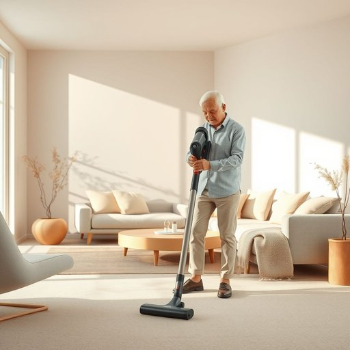

# usability

<h1 style="font-size: 2.5em; font-weight: 300; letter-spacing: 2px; margin: 0; color: #2c3e50;">
/usability*/
</h1>

---

---

## 例句

Although the sleek design of the new cordless vacuum is impressive, what truly sets it apart in our household is its exceptional usability, which, despite the complex array of attachments and settings, allows even my elderly parents to operate it efficiently without needing constant assistance.

*Although(/ˌɔlˈðoʊ/) the(/ðə/) sleek(/slik/) design(/dɪˈzaɪn/) of(/əv/) the(/ðə/) new(/nu/) cordless(/ˈkɔrdləs/) vacuum(/ˈvækjum/) is(/ɪz/) impressive,(/ˌɪmˈprɛsɪv,/) what(/wət/) truly(/ˈtruli/) sets(/sɛts/) it(/ɪt/) apart(/əˈpɑrt/) in(/ɪn/) our(/ɑr/) household(/ˈhaʊsˌhoʊld/) is(/ɪz/) its(/ɪts/) exceptional(/ɪkˈsɛpʃənəl/) usability,(/usability*,/) which,(/wɪʧ,/) despite(/dɪˈspaɪt/) the(/ðə/) complex(/ˈkɑmplɛks/) array(/əreɪ/) of(/əv/) attachments(/əˈtæʧmənts/) and(/ənd/) settings,(/ˈsɛtɪŋz,/) allows(/əˈlaʊz/) even(/ˈivɪn/) my(/maɪ/) elderly(/ˈɛldərli/) parents(/ˈpɛrənts/) to(/tɪ/) operate(/ˈɔpərˌeɪt/) it(/ɪt/) efficiently(/ɪˈfɪʃəntli/) without(/wɪˈθaʊt/) needing(/ˈnidɪŋ/) constant(/ˈkɑnstənt/) assistance.(/əˈsɪstəns./)*

**翻译：** 虽然这款全新无绳吸尘器的流线型设计令人印象深刻，但真正让它在我们家中独树一帜的是其卓越的易用性。尽管配备了复杂多样的附件和设置，它依然使我的年迈父母能够高效操作，无需时刻依赖他人帮助。

---

## 解释

英语单词“usability”作为名词，在家居生活用品场景中指的是某种产品或物品被使用的便利性和易用性，强调用户在实际使用过程中的体验和效率。例如，评价一个厨房电器的“usability”时，侧重于其操作是否简便、功能是否符合使用习惯、设计是否人性化等方面。在语法上，“usability”通常作为不可数名词使用，常见搭配有“high usability”（高易用性）、“improve usability”（提高易用性）、“usability testing”（易用性测试）等，英语学习者应注意其多用于正式或技术语境中，避免与“use”混淆。该词源自英语“usable”（可用的）加上名词后缀“-ity”，本身来自拉丁语，表示“……的性质或状态”，即“可用性的特征”。在中文环境中，最贴切的翻译是“易用性”或“使用便利性”，强调产品设计对用户友好和操作简便的特性，通常含褒义，带有积极评价的意味，指产品在实际使用中是否带给用户良好的体验，没有明显的贬义或负面色彩。综上，“usability”在家居用品领域是一个评价产品用户体验的重要术语，要求使用者结合具体场景理解其指向的设计和功能合理性。

---

<small style="color: #999; font-size: 0.9em;">2025-07-17 06:22:41</small>

