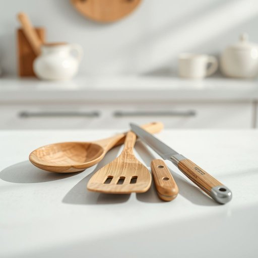

# utensil

<h1 style="font-size: 2.5em; font-weight: 300; letter-spacing: 2px; margin: 0; color: #2c3e50;">
/juˈtɛnsəl/
</h1>

---

---

## 例句

Before you start cooking, make sure you have every utensil you might need, such as a wooden spoon for stirring the sauce, a flexible spatula for flipping the pancakes, and a sharp paring knife for peeling the vegetables, because having the right utensil at hand can make all the difference between a stressful experience and an enjoyable one in the kitchen.

*Before(/ˌbiˈfɔr/) you(/ju/) start(/stɑrt/) cooking,(/ˈkʊkɪŋ,/) make(/meɪk/) sure(/ʃʊr/) you(/ju/) have(/hæv/) every(/ˈɛvəri/) utensil(/juˈtɛnsəl/) you(/ju/) might(/maɪt/) need,(/nid,/) such(/səʧ/) as(/ɛz/) a(/ə/) wooden(/ˈwʊdən/) spoon(/spun/) for(/fər/) stirring(/stərɪŋ/) the(/ðə/) sauce,(/sɔs,/) a(/ə/) flexible(/ˈflɛksəbəl/) spatula(/ˈspæˌʧʊlə/) for(/fər/) flipping(/ˈflɪpɪŋ/) the(/ðə/) pancakes,(/ˈpænˌkeɪks,/) and(/ənd/) a(/ə/) sharp(/ʃɑrp/) paring(/ˈpɛrɪŋ/) knife(/naɪf/) for(/fər/) peeling(/ˈpilɪŋ/) the(/ðə/) vegetables,(/ˈvɛʤtəbəlz,/) because(/bɪˈkəz/) having(/ˈhævɪŋ/) the(/ðə/) right(/raɪt/) utensil(/juˈtɛnsəl/) at(/æt/) hand(/hænd/) can(/kən/) make(/meɪk/) all(/ɔl/) the(/ðə/) difference(/ˈdɪfərəns/) between(/bɪtˈwin/) a(/ə/) stressful(/ˈstrɛsfəl/) experience(/ɪkˈspɪriəns/) and(/ənd/) an(/ən/) enjoyable(/ˌɛnˈʤɔɪəbəl/) one(/wən/) in(/ɪn/) the(/ðə/) kitchen.(/ˈkɪʧən./)*

**翻译：** 在开始烹饪之前，务必准备好可能用到的所有厨具，比如用来搅拌酱汁的木勺、翻煎饼时灵活的刮刀，以及用来削蔬菜的锋利小刀。因为手边备齐合适的厨具，往往能让厨房里的体验从紧张变得愉快。

---

## 解释

英语单词“utensil”作为名词在家居生活用品的语境中，通常指日常厨房或餐桌上使用的各种器具，如锅碗瓢盆、刀叉勺、刨丝器等，用于烹饪、盛装或食用食物。具体使用场合多见于描述厨房工具、餐具集合、家居清洁和收纳等话题，例如“kitchen utensils”（厨房用具）或“cooking utensils”（烹饪用具）。英语学习者在使用该词时需注意，“utensil”通常为可数名词，其复数形式为“utensils”，且多用于统称诸多小型家用工具。此外，常见搭配包括“kitchen utensils”、“wooden utensils”、“metal utensils”等，用于限定材质或使用环境，符合日常表达习惯。“Utensil”一词源自拉丁语“utensilia”，意为“使用的东西”，体现了其实用性和工具属性，没有贬义或特殊色彩。其对应的中文翻译一般为“用具”或“器具”，在家居生活语境中多指厨房用具或餐具，强调实用功能，区别于专门的装饰品或家具。总的来说，“utensil”在中文语境中应理解为日常生活中使用的各类小工具，具有中性、实用的词义，无褒贬感情色彩。

---

<small style="color: #999; font-size: 0.9em;">2025-07-17 06:22:41</small>

