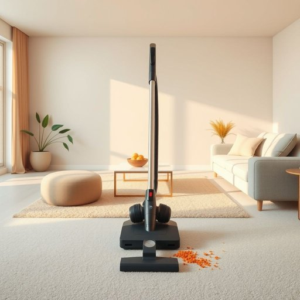

# vacuum

<h1 style="font-size: 2.5em; font-weight: 300; letter-spacing: 2px; margin: 0; color: #2c3e50;">
/ˈvækjum/
</h1>

---

---

## 例句

After dinner, while I was tidying up the living room, I noticed that the vacuum, which had been sitting unused in the cupboard for months, needed a new filter before it could effectively pick up all the dust and crumbs scattered across the carpet and sofa cushions.

*After(/ˈæftər/) dinner,(/ˈdɪnər,/) while(/waɪl/) I(/aɪ/) was(/wɑz/) tidying(/tidying*/) up(/əp/) the(/ðə/) living(/ˈlɪvɪŋ/) room,(/rum,/) I(/aɪ/) noticed(/ˈnoʊtɪst/) that(/ðət/) the(/ðə/) vacuum,(/ˈvækjum,/) which(/wɪʧ/) had(/hæd/) been(/bɪn/) sitting(/ˈsɪtɪŋ/) unused(/ənˈjuzd/) in(/ɪn/) the(/ðə/) cupboard(/ˈkəbərd/) for(/fər/) months,(/mənθs,/) needed(/ˈnidɪd/) a(/ə/) new(/nu/) filter(/ˈfɪltər/) before(/ˌbiˈfɔr/) it(/ɪt/) could(/kʊd/) effectively(/ˈifɛktɪvli/) pick(/pɪk/) up(/əp/) all(/ɔl/) the(/ðə/) dust(/dəst/) and(/ənd/) crumbs(/krəmz/) scattered(/ˈskætərd/) across(/əˈkrɔs/) the(/ðə/) carpet(/ˈkɑrpət/) and(/ənd/) sofa(/ˈsoʊfə/) cushions.(/ˈkʊʃənz./)*

**翻译：** 晚饭后，当我整理客厅时，注意到那台好几个月未用、一直放在橱柜里的吸尘器需要更换滤芯，才能有效清理散落在地毯和沙发垫上的灰尘和碎屑。

---

## 解释

在家居生活用品的语境中，英语单词"vacuum"作为名词通常指的是“吸尘器”，即用于清理地面灰尘和碎屑的家用电器。具体使用场合多见于描述清洁工具或家务活动，如“It’s time to use the vacuum to clean the carpet.”（该用吸尘器清理地毯了）。英语学习者需要注意，"vacuum"作为名词时常与动词"use"、"turn on"、"run"等搭配，如“to use the vacuum”、“turn on the vacuum”，此外常见表达还有"vacuum cleaner"，这是该词的完整形式，单独用"vacuum"也被广泛接受且口语化程度高。语法上，它是可数名词，可以有复数形式"vacuums"。其词源来自拉丁语“vacuus”，意为“空的”，最初指空间中的“真空”状态，后来引申用于指依靠吸力工作的设备。中文语境中，“vacuum”作为家居用品名词应准确翻译为“吸尘器”，避免与其物理学意义的“真空”混淆。在日常语言中没有褒贬色彩，属中性词，使用时主要关注上下文明确是指清洁工具。文化上，吸尘器作为现代家电的重要组成，体现了便利和卫生的生活理念，故此词在家居生活中经常出现且意义明确。

---

<small style="color: #999; font-size: 0.9em;">2025-07-17 06:22:41</small>

