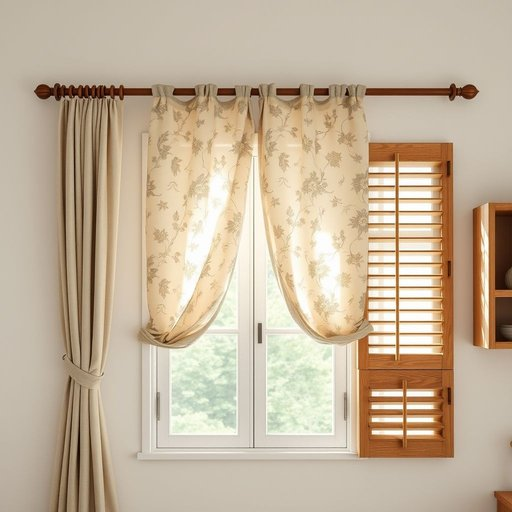

# valance

<h1 style="font-size: 2.5em; font-weight: 300; letter-spacing: 2px; margin: 0; color: #2c3e50;">
/valance*/
</h1>

---

---

## 例句

Could you please help me decide whether the floral valance above the kitchen window, which complements the vintage curtains and the rustic wooden blinds, should be replaced with something more modern, or if it still adds the perfect touch of charm to the room's overall farmhouse aesthetic?

*Could(/kʊd/) you(/ju/) please(/pliz/) help(/hɛlp/) me(/mi/) decide(/ˌdɪˈsaɪd/) whether(/ˈwɛðər/) the(/ðə/) floral(/ˈflɔrəl/) valance(/valance*/) above(/əˈbəv/) the(/ðə/) kitchen(/ˈkɪʧən/) window,(/ˈwɪndoʊ,/) which(/wɪʧ/) complements(/ˈkɑmpləmənts/) the(/ðə/) vintage(/ˈvɪntɪʤ/) curtains(/ˈkərtənz/) and(/ənd/) the(/ðə/) rustic(/ˈrəstɪk/) wooden(/ˈwʊdən/) blinds,(/blaɪndz,/) should(/ʃʊd/) be(/bi/) replaced(/ˌriˈpleɪst/) with(/wɪθ/) something(/ˈsəmθɪŋ/) more(/mɔr/) modern,(/ˈmɑdərn,/) or(/ər/) if(/ɪf/) it(/ɪt/) still(/stɪl/) adds(/ædz/) the(/ðə/) perfect(/ˈpərˌfɪkt/) touch(/təʧ/) of(/əv/) charm(/ʧɑrm/) to(/tɪ/) the(/ðə/) room's(/rumz/) overall(/ˈoʊvərˌɔl/) farmhouse(/ˈfɑrmˌhaʊs/) aesthetic?(/ɛsˈθɛtɪk?/)*

**翻译：** 您能帮我决定一下，厨房窗户上方那个花卉窗幔——它与复古窗帘和质朴木制百叶窗相得益彰——是否应该换成更现代的款式，还是它依然为整个房间的田园风格增添了完美的魅力？

---

## 解释

英语单词“valance”在家居生活用品的语境中作为名词，主要指窗帘顶部或床架边缘装饰用的短布帘，通常用于遮盖窗帘挂钩或床垫底部，以增强整体美观和装饰效果。具体使用场合多见于窗户装饰时的窗帘顶部布帘，以及床周围床罩边缘的一种装饰性布料。英语学习者在使用“valance”时，需注意其作为可数名词，常与“window valance”（窗帘檐布）、“bed valance”（床裙）等词组搭配，且多用于描述家具或房间装饰的细节，表达时常结合具体物体的位置或用途，如“hang a valance above the window”。此外，需避免将其与“valence”混淆，后者含义不同。该词源自中古法语“valence”，可能源自拉丁语，最初含义与悬垂装饰布相关。中文语境中，“valance”通常准确翻译为“窗帘檐布”或“床裙”，强调其装饰功能，属于无褒贬色彩的中性词汇，是室内装饰设计中的专业术语。理解时应聚焦于其具体功能性和装饰性，而非一般窗帘或床罩。

---

<small style="color: #999; font-size: 0.9em;">2025-07-17 06:22:41</small>

