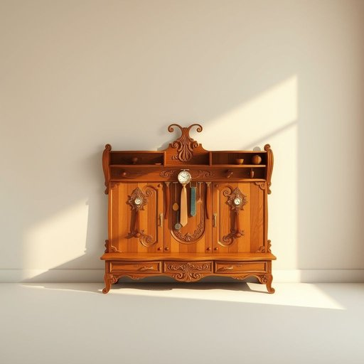

# valet

<h1 style="font-size: 2.5em; font-weight: 300; letter-spacing: 2px; margin: 0; color: #2c3e50;">
/væˈleɪ/
</h1>

---

---

## 例句

After returning from a long day at work, I placed my jacket carefully on the antique valet in the hallway, which, with its intricate woodwork and multiple compartments designed to hold ties, cufflinks, and watches, serves not only as a practical piece of furniture but also as a charming focal point that helps keep my evenings organized and my essentials readily accessible.

*After(/ˈæftər/) returning(/rɪˈtərnɪŋ/) from(/frəm/) a(/ə/) long(/lɔŋ/) day(/deɪ/) at(/æt/) work,(/wərk,/) I(/aɪ/) placed(/pleɪst/) my(/maɪ/) jacket(/ˈʤækɪt/) carefully(/ˈkɛrfəli/) on(/ɔn/) the(/ðə/) antique(/ænˈtik/) valet(/væˈleɪ/) in(/ɪn/) the(/ðə/) hallway,(/ˈhɔlˌweɪ,/) which,(/wɪʧ,/) with(/wɪθ/) its(/ɪts/) intricate(/ˈɪntrəkət/) woodwork(/ˈwʊdˌwərk/) and(/ənd/) multiple(/ˈməltəpəl/) compartments(/kəmˈpɑrtmənts/) designed(/dɪˈzaɪnd/) to(/tɪ/) hold(/hoʊld/) ties,(/taɪz,/) cufflinks,(/cufflinks*,/) and(/ənd/) watches,(/ˈwɑʧɪz,/) serves(/sərvz/) not(/nɑt/) only(/ˈoʊnli/) as(/ɛz/) a(/ə/) practical(/ˈpræktɪkəl/) piece(/pis/) of(/əv/) furniture(/ˈfərnɪʧər/) but(/bət/) also(/ˈɔlsoʊ/) as(/ɛz/) a(/ə/) charming(/ˈʧɑrmɪŋ/) focal(/ˈfoʊkəl/) point(/pɔɪnt/) that(/ðət/) helps(/hɛlps/) keep(/kip/) my(/maɪ/) evenings(/ˈivnɪŋz/) organized(/ˈɔrgəˌnaɪzd/) and(/ənd/) my(/maɪ/) essentials(/ɛˈsɛnʃəlz/) readily(/ˈrɛdəli/) accessible.(/ækˈsɛsəbəl./)*

**翻译：** 一天辛劳工作结束回家后，我小心翼翼地将外套挂在走廊里那件古董衣帽架上。这件衣帽架雕工细致，设有多个格子专门用来存放领带、袖扣和手表，不仅实用，更成为一个别致的视觉焦点，帮助我整理夜晚的生活，使必需品触手可及。

---

## 解释

在家居生活用品的语境中，英语单词“valet”作为名词主要指一种专门设计用来收纳和整理衣物、配饰的小型家具或装置，通常包括裤架、领带架、挂衣杆、鞋架等，方便用户有序存放西装、衬衫、领带等日常穿戴物品，常见于卧室或更衣室。具体使用场合通常是在描述卧室布置、室内家具配置或衣物整理时。例如，“a valet stand”就是英语中常见的表达，指这种衣物整理架。英语学习者使用“valet”时需注意它既可指人的职业（如私人男仆、代客泊车员），也可指这类家具，常通过上下文判断含义；作为家具时，通常与“stand”、“rack”等词搭配，且作为名词使用时不加复数形式“valets”较少见。词源上，“valet”源自法语中古词“varlet”，最初指侍从或男仆，后来引申出为主人服务的人员及用品，这一背景体现了其与服饰和服务的关联。在中文语境中，“valet”作为家居用品准确翻译通常为“男士衣帽架”、“衣物整理架”或音译“瓦莱特架”，强调其功能性和专业收纳属性。需要注意的是，“valet”在日常英语中更多被理解为职业身份的“贴身男仆”，用作家居用品名称时较为专业和正式，且带有一定的英式或法式生活品味色彩，无明显褒贬，但给人较为高端或古典的文化氛围。

---

<small style="color: #999; font-size: 0.9em;">2025-07-17 06:22:41</small>

