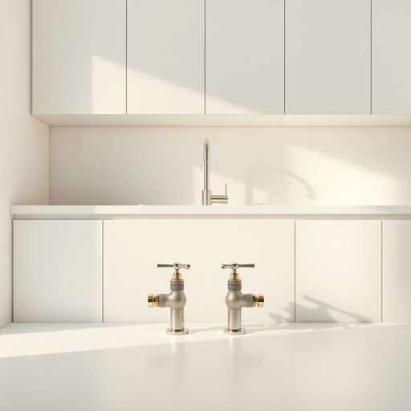

# valve

<h1 style="font-size: 2.5em; font-weight: 300; letter-spacing: 2px; margin: 0; color: #2c3e50;">
/vælv/
</h1>

---

---

## 例句

Before you call a plumber, make sure the valve under the kitchen sink, which controls the water flow to the dishwasher and the tap, is fully open and hasn't been accidentally turned off during the renovation last week.

*Before(/ˌbiˈfɔr/) you(/ju/) call(/kɔl/) a(/ə/) plumber,(/ˈpləmər,/) make(/meɪk/) sure(/ʃʊr/) the(/ðə/) valve(/vælv/) under(/ˈəndər/) the(/ðə/) kitchen(/ˈkɪʧən/) sink,(/sɪŋk,/) which(/wɪʧ/) controls(/kənˈtroʊlz/) the(/ðə/) water(/ˈwɔtər/) flow(/floʊ/) to(/tɪ/) the(/ðə/) dishwasher(/ˈdɪʃˌwɑʃər/) and(/ənd/) the(/ðə/) tap,(/tæp,/) is(/ɪz/) fully(/ˈfʊli/) open(/ˈoʊpən/) and(/ənd/) hasn't(/ˈhæzənt/) been(/bɪn/) accidentally(/ˌæksəˈdɛnəli/) turned(/tərnd/) off(/ɔf/) during(/ˈdʊrɪŋ/) the(/ðə/) renovation(/ˌrɛnəˈveɪʃən/) last(/læst/) week.(/wik./)*

**翻译：** 在你联系水管工之前，请先确认厨房水槽下控制洗碗机和水龙头进水的阀门是否已完全打开，且未在上周装修时被意外关闭。

---

## 解释

英语单词“valve”作为名词在家居生活用品场景中通常指的是控制流体如水、气体等流动的装置，常见于水龙头、暖气系统、燃气设备以及洗衣机等家用电器中，用来开启、关闭或调节管道中的液体或气体流动。在使用时，学习者应注意“valve”通常可数，常与动词“turn on/off”打开关闭、“open/close the valve”开关阀门搭配，且在描述功能时经常与形容词连用，如“safety valve”安全阀、“pressure valve”压力阀。此外，“valve”作为技术名词，语境多趋向正式或专业，使用时需避免混淆同义词“tap”或“faucet”等更具体指水龙头的词汇。词源上，“valve”源自拉丁语“valva”，意为可开的门叶，体现其控制通道开启关闭的功能。中文语境中，“valve”通常准确翻译为“阀门”，强调其作为控制流动的设备，理解时应结合具体类型和使用环境区分，如家用水管中的阀门、燃气管道阀门等，避免泛指所有开关装置。该词本身无褒贬色彩，属于中性技术词汇，在家居生活中多与安全和功能性紧密相关。

---

<small style="color: #999; font-size: 0.9em;">2025-07-17 06:22:41</small>

