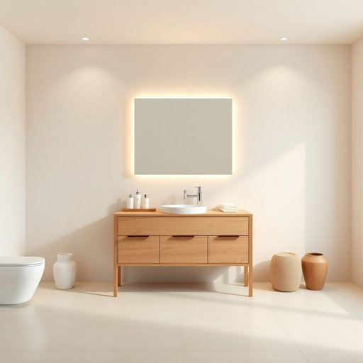

# vanity

<h1 style="font-size: 2.5em; font-weight: 300; letter-spacing: 2px; margin: 0; color: #2c3e50;">
/ˈvænɪti/
</h1>

---

---

## 例句

After struggling to find enough storage space in the cramped bathroom, we finally decided to replace the old, worn-out cabinet with a sleek, modern vanity that not only accommodates all our toiletries neatly but also features a built-in mirror with integrated lighting, which, given how much time I spend on my morning routine, turned out to be an invaluable addition to our daily lives.

*After(/ˈæftər/) struggling(/ˈstrəgəlɪŋ/) to(/tɪ/) find(/faɪnd/) enough(/ɪˈnəf/) storage(/ˈstɔrɪʤ/) space(/speɪs/) in(/ɪn/) the(/ðə/) cramped(/kræmpt/) bathroom,(/ˈbæθˌrum,/) we(/wi/) finally(/ˈfaɪnəli/) decided(/ˌdɪˈsaɪdɪd/) to(/tɪ/) replace(/ˌriˈpleɪs/) the(/ðə/) old,(/oʊld,/) worn-out(/worn-out*/) cabinet(/ˈkæbənət/) with(/wɪθ/) a(/ə/) sleek,(/slik,/) modern(/ˈmɑdərn/) vanity(/ˈvænɪti/) that(/ðət/) not(/nɑt/) only(/ˈoʊnli/) accommodates(/əˈkɑməˌdeɪts/) all(/ɔl/) our(/ɑr/) toiletries(/ˈtɔɪlətriz/) neatly(/ˈnitli/) but(/bət/) also(/ˈɔlsoʊ/) features(/ˈfiʧərz/) a(/ə/) built-in(/ˈbɪlˌtɪn/) mirror(/ˈmɪrər/) with(/wɪθ/) integrated(/ˈɪnəˌgreɪtɪd/) lighting,(/ˈlaɪtɪŋ,/) which,(/wɪʧ,/) given(/ˈgɪvɪn/) how(/haʊ/) much(/məʧ/) time(/taɪm/) I(/aɪ/) spend(/spɛnd/) on(/ɔn/) my(/maɪ/) morning(/ˈmɔrnɪŋ/) routine,(/ruˈtin,/) turned(/tərnd/) out(/aʊt/) to(/tɪ/) be(/bi/) an(/ən/) invaluable(/ˌɪnˈvæljəbəl/) addition(/əˈdɪʃən/) to(/tɪ/) our(/ɑr/) daily(/ˈdeɪli/) lives.(/lɪvz./)*

**翻译：** 经过在狭小的浴室里苦苦寻找足够的储物空间后，我们最终决定将那旧旧破损的橱柜换成一款简洁现代的洗手台柜。它不仅能整齐地收纳我们的所有洗漱用品，还配备了带有内置照明的镜子。考虑到我每天早晨花费的时间，这一设计成为了我们日常生活中极为珍贵的提升。

---

## 解释

在家居生活用品的语境中，英语单词“vanity”作为名词通常指的是“洗手台柜”或“浴室梳妆柜”，即带有洗手盆并附有储物空间的家具，常见于浴室或卧室中。具体使用场合多为描述家装设计、家具采购或浴室设施时，例如“a bathroom vanity”指浴室中的洗手台组合。英语学习者在使用“vanity”时应注意其多义性，除了家具含义外，该词主要还有“虚荣心”的意思，常用表达如“her vanity was hurt”（她的虚荣心受伤了）。因此，在家居用品语境中应结合环境确认意指家具，避免混淆。在语法方面，“vanity”作为可数名词时强调具体的家具，如“two vanities in the house”，不可数时多指虚荣的概念。常见搭配包括“bathroom vanity”，“vanity unit”，“double vanity”（双盆洗手台）等。词源方面，"vanity"源自拉丁语“vanitas”，意为“虚空、徒劳”，其家具含义起源于装饰梳妆台的镜子和容器，隐含“自我装饰”或“美容”的功能，后来引申至实际的浴室家具。中文语境中准确翻译为“（浴室）洗手台柜”或“梳妆台柜”，强调其功能性和家具属性，而非“虚荣”这一抽象含义。需要注意的是，“vanity”在文化语境中带有贬义色彩，表示过度自负或注重外表，使用时要根据语境谨慎辨别，以免产生语义混淆或误用。

---

<small style="color: #999; font-size: 0.9em;">2025-07-17 06:22:41</small>

