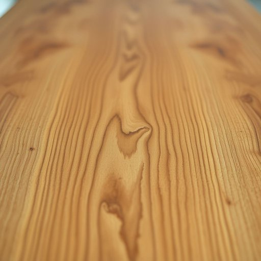

# veneer

<h1 style="font-size: 2.5em; font-weight: 300; letter-spacing: 2px; margin: 0; color: #2c3e50;">
/vəˈnɪr/
</h1>

---

---

## 例句

The old dining table, which we've been meaning to restore for months, has a delicate veneer that, despite its thinness, remarkably conceals the scars and dents underneath, giving the piece a polished and elegant appearance that truly enhances the character of our living room.

*The(/ðə/) old(/oʊld/) dining(/ˈdaɪnɪŋ/) table,(/ˈteɪbəl,/) which(/wɪʧ/) we've(/wiv/) been(/bɪn/) meaning(/ˈminɪŋ/) to(/tɪ/) restore(/rɪˈstɔr/) for(/fər/) months,(/mənθs,/) has(/həz/) a(/ə/) delicate(/ˈdɛləkət/) veneer(/vəˈnɪr/) that,(/ðət,/) despite(/dɪˈspaɪt/) its(/ɪts/) thinness,(/ˈθɪnɪs,/) remarkably(/rɪˈmɑrkəbli/) conceals(/kənˈsilz/) the(/ðə/) scars(/skɑrz/) and(/ənd/) dents(/dɛnts/) underneath,(/ˌəndərˈniθ,/) giving(/ˈgɪvɪŋ/) the(/ðə/) piece(/pis/) a(/ə/) polished(/ˈpɑlɪʃt/) and(/ənd/) elegant(/ˈɛləgənt/) appearance(/əˈpɪrəns/) that(/ðət/) truly(/ˈtruli/) enhances(/ɛnˈhænsɪz/) the(/ðə/) character(/ˈkɛrɪktər/) of(/əv/) our(/ɑr/) living(/ˈlɪvɪŋ/) room.(/rum./)*

**翻译：** 那张我们已打算修复数月的旧餐桌，拥有一层纤薄却精致的单板，尽管薄如蝉翼，却出人意料地掩盖住了其下的划痕与凹痕，使整件家具呈现出光滑典雅的外观，真正提升了我们客厅的格调与韵味。

---

## 解释

在家居生活用品的语境中，英语名词veneer主要指覆盖在家具表面的一层薄木皮或薄板，用以改善家具外观或保护底层材质，常见于橱柜、桌面、地板等木制品上。具体使用场合一般涉及家具制造、装修设计或木工工艺讨论，例如描述某张桌子has a cherry veneer表示桌面覆盖了樱桃木薄片。英语学习者使用该词时需注意，veneer作为名词通常是可数的，复数形式为veneers，而且常与名词词组搭配，如wood veneer、veneer finish、veneer layer，常见搭配还包括动词短语apply veneer或strip veneer，表达贴覆或剥离薄板的动作。语法上，veneer通常作为可数名词用于具体指一片薄木皮，也可泛指这一材质类别。其词源来自拉丁语venaria，意指覆盖物，经过法语veneir演变而来，最终进入英语，体现了其作为覆盖层的本质。中文语境中，veneer准确译为单板或木皮，部分情况下也称饰面板，强调其作为覆盖层的特性，而非实心木材。在使用时需避免将veneer误解为整块实木，因其结构和性能与实木有所不同。该词在日常描述中无明显褒贬色彩，但在家具品质评价中，单板家具通常被视为成本较低且装饰性强的选择，可能暗示非全实木的工艺属性，故在文化语境中有时带有表面光鲜但内里非实质的隐含含义。

---

<small style="color: #999; font-size: 0.9em;">2025-07-17 06:22:41</small>

